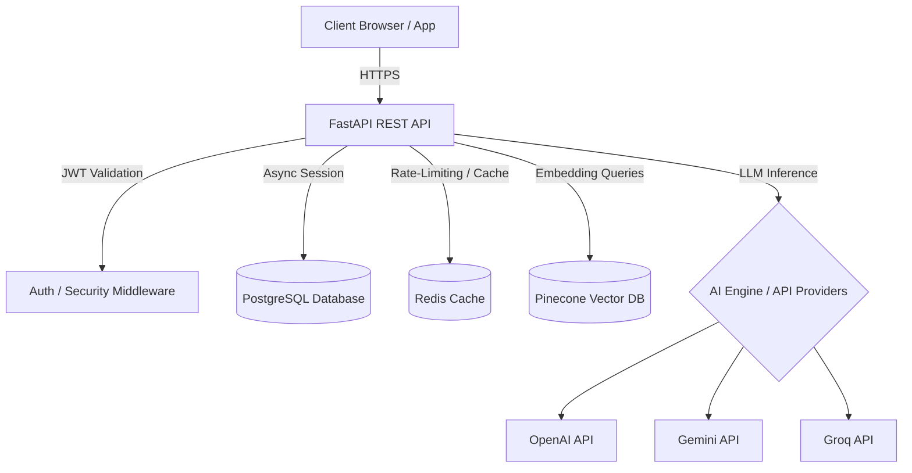

# N.O.V.A Learning Platform Backend


This repository contains the backend codebase for the N.O.V.A learning platform. It is built as a high-performance, asynchronous REST API using Python and the FastAPI framework.

---

## Project Status

Active Development

Current Milestone: Backend Foundation and Authentication Complete

---

## Features

### Current Features
- **User Authentication**: Secure signup, login, and token generation.
- **Google OAuth Login**: Direct authentication utilizing Google sign-in.
- **Role-Based Access Control**: Domain access verification for Admins, Lecturers, and Students.
- **Multi-Institution Support**: Logical isolation of database records based on institutions and departments.
- **Asynchronous Architecture**: Non-blocking database transactions and endpoint handlers.
- **Interactive Documentation**: Automatic API specs served dynamically via Swagger and ReDoc.

### Planned Features
- **AI Tutor Integration**: Real-time conversational AI tutors assigned to courses.
- **Retriewval-Augmented Generation (RAG)**: Context-aware document querying using semantic vectors.
- **Quiz Generation**: AI-driven quiz creation and scoring mechanisms.
- **Student Skill Passport**: Automated skill profile verification and badges.
- **Digital Certificates**: Generation and verification of digital course credentials.
- **Workflow Automation**: Trigger-based administrative actions and notifications.
- **Analytics Dashboard**: Comprehensive reports on course performance and learner telemetry.

---

## Architectural Diagram



---

## Architectural Overview

The backend is designed following clean architecture principles, emphasizing separation of concerns, asynchronous database operations, and containerization.

### Core Domain Models
The database schema consists of several integrated subsystems:
- **Identity & Access Management**: Managed via User, Role, and Permission models with JWT-based state validation.
- **Academic Structure**: Models for Institution, Department, Course, Enrollment, and Lecture to structure course curricula.
- **Learning Resources & RAG Ingestion**: Resource and KnowledgeBase models for managing files and mapping their embeddings to specific Pinecone vector namespaces.
- **AI Integration**: AIConversation, Question, and Escalation models to support conversational AI tutors and human-in-the-loop escalations.
- **Gamification & Student Portfolios**: Badge, Certificate, SkillPassport, and Portfolio models to support digital credentials and skills verification.
- **Workflow & Event Processing**: Workflow and Notification models for trigger-based communication.
- **Auditing**: AuditLog model to log system operations and user actions.

---

## Security Features

- **JWT Authentication**: Secure stateless token-based authorization.
- **Password Cryptography**: Secure password hashing using Passlib with the bcrypt backend.
- **Google OAuth 2.0**: Integrated social authentication with automated domain-to-institution linking.
- **Role-Based Access Control (RBAC)**: Fine-grained user access control based on roles and permissions.
- **Secrets Management**: Configuration securely parsed via Pydantic Settings using decoupled environment variables.

---

## API Design

- **RESTful Endpoints**: Predictable, resource-oriented URL patterns and HTTP methods.
- **Data Serialization**: JSON-formatted payloads for all requests and responses.
- **Authorization**: Bearer token authentication via the HTTP `Authorization` header.
- **Dynamic Spec Generation**: OpenAPI specifications generated automatically.
- **Request Validation**: Automatic schema enforcement using Pydantic.

---

## Technology Stack

The service utilizes the following technologies:
- **Core Framework**: FastAPI for ASGI-compatible API routing and automatic OpenAPI documentation generation.
- **Asynchronous ORM**: SQLAlchemy 2.0 (asyncio extension) with asyncpg driver.
- **Database Migrations**: Alembic for tracking, generating, and running migrations.
- **Relational Storage**: PostgreSQL 15 as the primary relational database.
- **Caching & Brokering**: Redis 7 for cache management and rate-limiting.
- **Vector Storage**: Pinecone for semantic searching and Retrieval-Augmented Generation (RAG).
- **AI Providers**: OpenAI, Google Generative AI (Gemini), and Groq for conversational capabilities and quiz generation.
- **Security**: Passlib and bcrypt for secure password hashing; python-jose for JWT signatures.

---

## Project Structure

```
backend/
├── alembic/                  # Database migration scripts and versions
│   ├── env.py                # Alembic environment configuration
│   └── versions/             # Migration version history
├── app/                      # Application source code
│   ├── api/                  # API routers and endpoints
│   ├── auth/                 # Authentication, authorization, and JWT security
│   ├── core/                 # Global configuration and settings parsing
│   ├── db/                   # Database session setup, declarative base, and mixins
│   ├── models/               # SQLAlchemy models (mapped classes)
│   └── schemas/              # Pydantic schemas for data serialization and validation
├── requirements/             # Dependency lists
│   ├── base.txt              # Production and core dependencies
│   └── local.txt             # Development and testing dependencies
├── tests/                    # Unit and integration test suite
├── Dockerfile                # Production container definition
├── pyproject.toml            # Project tool configurations (Black, Pytest, Isort)
├── alembic.ini               # Alembic configuration file
└── README.md                 # Project documentation
```

---

## Environment Configuration

The application reads configuration parameters from environmental variables. When running locally, it resolves them from `.env.local`. When running inside Docker, it resolves them from `.env.docker`.

Ensure the following variables are configured:

| Variable | Description | Default Value |
|---|---|---|
| `APP_NAME` | Name of the FastAPI application | `N.O.V.A API` |
| `APP_VERSION` | Current application version | `1.0.0` |
| `DEBUG` | Enable debugger mode and stacktraces | `True` |
| `API_V1_STR` | Global path prefix for version 1 endpoints | `/api/v1` |
| `DATABASE_URL` | SQLAlchemy connection string | `postgresql+asyncpg://nova_user:nova_password@db:5432/nova_db` |
| `REDIS_URL` | Redis instance connection URL | `redis://redis:6379/0` |
| `JWT_SECRET_KEY` | Secret key used to sign JWT access tokens | (Required) |
| `JWT_ALGORITHM` | Hashing algorithm for signature | `HS256` |
| `ACCESS_TOKEN_EXPIRE_MINUTES` | Expiration time for access tokens | `30` |
| `GOOGLE_CLIENT_ID` | OAuth2 client identifier | `""` |
| `GOOGLE_CLIENT_SECRET` | OAuth2 client secret key | `""` |
| `OPENAI_API_KEY` | OpenAI API access key | `""` |
| `GEMINI_API_KEY` | Google Gemini API access key | `""` |
| `GROQ_API_KEY` | Groq API access key | `""` |
| `PINECONE_API_KEY` | Pinecone vector DB access key | `""` |

---

## Installation and Execution

### Running via Docker Compose (Recommended)

1. Clone the repository and navigate to the project directory:
   ```bash
   cd nova-platform
   ```

2. Start all services (Database, Redis, Backend, Frontend) in detached mode:
   ```bash
   docker compose up -d
   ```

3. View live execution logs (where `backend` is the service name defined in `docker-compose.yml`):
   ```bash
   docker compose logs -f backend
   ```

4. Stop all services and clean up network interfaces:
   ```bash
   docker compose down
   ```

### Running Locally with Virtualenv

1. Create and activate a Python virtual environment:
   ```bash
   cd backend
   python -m venv venv
   source venv/bin/activate
   ```

2. Install core and local dependencies:
   ```bash
   pip install -r requirements/local.txt
   ```

3. Export environment variables or create a `.env.local` file:
   ```bash
   cp .env.example .env.local
   ```

4. Run the Uvicorn ASGI server:
   ```bash
   uvicorn app.main:app --reload --host 127.0.0.1 --port 8000
   ```

---

## Database Migrations

Database schemas are tracked using Alembic. 

- **Run Pending Migrations**:
  To apply all outstanding migrations to the target database:
  ```bash
  docker compose exec backend alembic upgrade head
  ```

- **Generate a New Migration**:
  To automatically detect model changes and generate a new migration file:
  ```bash
  docker compose exec backend alembic revision --autogenerate -m "description_of_changes"
  ```

- **Roll Back Migrations**:
  To revert the last applied migration:
  ```bash
  docker compose exec backend alembic downgrade -1
  ```

---

## API Endpoints and Interactive Documentation

Once the backend is running, automatic interactive documentation is available:
- **Swagger UI**: [http://localhost:8000/docs](http://localhost:8000/docs) (best for direct testing and execution)
- **ReDoc**: [http://localhost:8000/redoc](http://localhost:8000/redoc) (best for API consumption reference)

### Principal Routes
- **Authentication**: `POST /api/v1/auth/register`, `POST /api/v1/auth/login`, `POST /api/v1/auth/google`, `GET /api/v1/auth/me`
- **Health Check (unversioned)**: `GET /health`

---

## Testing and Quality Assurance

The application uses `pytest` for automated unit and integration tests, alongside code formatters to maintain quality standards.

- **Run Automated Tests**:
  ```bash
  docker compose exec backend pytest
  ```

- **Run Tests with Coverage**:
  ```bash
  docker compose exec backend pytest --cov=app
  ```

- **Code Formatting and Linting**:
  Configurations for Black and Isort are specified in `pyproject.toml`. Run them locally to maintain coding standards:
  ```bash
  black app/
  isort app/
  ```

---

## Contributing

Contributions, bug reports, and feature suggestions are welcome.
Please open an issue before submitting large changes.

---

## License

This project is licensed under the MIT License. See the [LICENSE](../LICENSE) file in the repository root for details.
