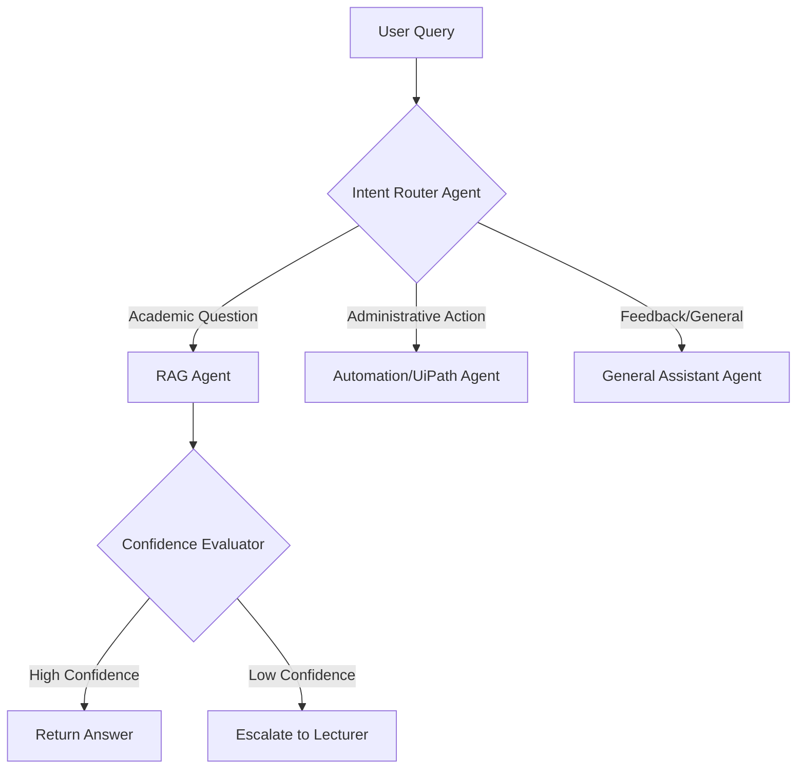

# AI Architecture

## 1. Multi-Agent AI System
N.O.V.A. utilizes a multi-agent framework to categorize, route, and resolve user requests.

## 2. Agent Workflow

```mermaid
graph TD
    Query[User Query] --> Router{Intent Router Agent}
    Router -->|Academic Question| RAGAgent[RAG Agent]
    Router -->|Administrative Action| AutoAgent[Automation/UiPath Agent]
    Router -->|Feedback/General| GeneralAgent[General Assistant Agent]
    RAGAgent --> Evaluator{Confidence Evaluator}
    Evaluator -->|High Confidence| Response[Return Answer]
    Evaluator -->|Low Confidence| Escalator[Escalate to Lecturer]
```
