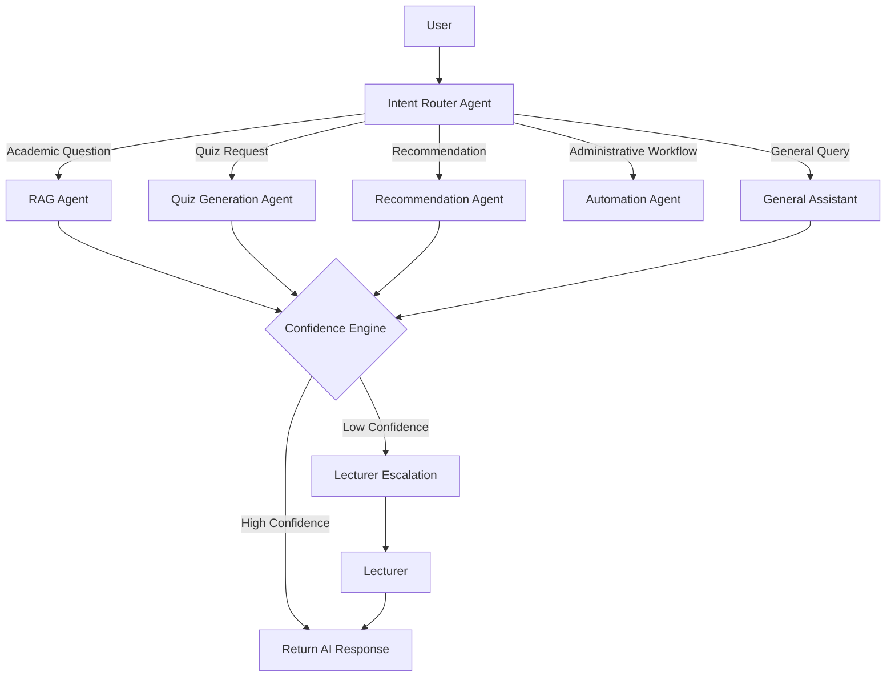
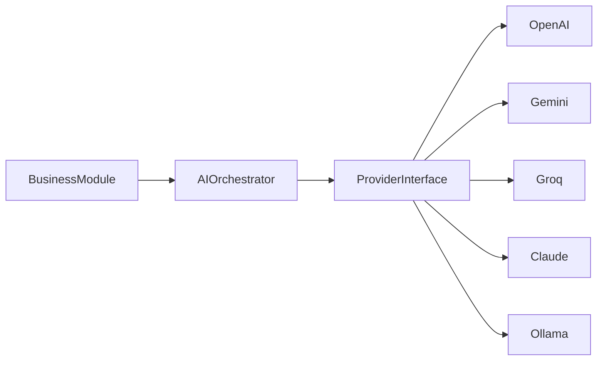
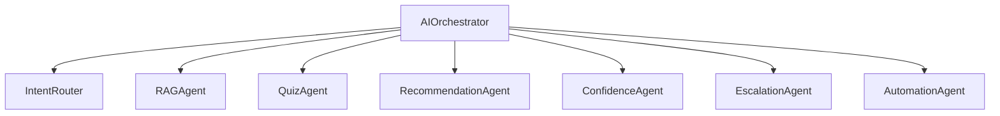

# AI Architecture

---

# 1. Introduction

## 1.1 Purpose

This document defines the Artificial Intelligence architecture of the N.O.V.A. platform. It describes the design principles, AI processing pipeline, multi-agent framework, provider abstraction, confidence evaluation, and lecturer escalation mechanism used to deliver intelligent educational assistance.

The AI architecture is designed to provide accurate, explainable, and reliable responses while ensuring lecturer oversight whenever confidence is insufficient.

---

# 2. AI Design Principles

The AI subsystem is designed according to the following principles:

* Multi-Agent Collaboration
* Retrieval-Augmented Generation (RAG)
* Provider Independence
* Explainability
* Confidence-Based Decision Making
* Human-in-the-Loop Validation
* Context Awareness
* Modular AI Services

These principles ensure that AI capabilities remain maintainable, extensible, and aligned with institutional academic standards.

---

# 3. AI Layer Overview

The AI layer operates as an independent intelligence layer within the N.O.V.A. platform.

Its primary responsibilities include:

* Understanding user intent
* Retrieving relevant academic knowledge
* Generating contextual responses
* Producing quizzes
* Recommending learning resources
* Evaluating response confidence
* Escalating uncertain queries to lecturers

The AI layer never directly modifies academic records. All updates are performed through the business modules.

---

# 4. Multi-Agent Architecture

Rather than relying on a single AI model, N.O.V.A. adopts a Multi-Agent Architecture.

Each agent is responsible for a specialized task.

Benefits include:

* Separation of Responsibilities
* Better Maintainability
* Easier Testing
* Independent Evolution
* Improved Accuracy
* Easier Future Expansion

The AI Orchestrator coordinates all agents throughout the request lifecycle.

---

# 5. AI Agents

## 5.1 Intent Router Agent

### Responsibilities

* Analyze user intent.
* Classify incoming requests.
* Select the appropriate specialized AI agent.

Example request categories:

* Academic Question
* Quiz Generation
* Learning Recommendation
* Administrative Workflow
* General Assistance

---

## 5.2 RAG Agent

Responsible for answering academic questions using institutional knowledge.

Responsibilities include:

* Query understanding
* Semantic retrieval
* Context assembly
* Citation generation
* Grounded response generation

The RAG Agent shall prioritize lecturer-approved resources.

---

## 5.3 Quiz Generation Agent

Responsible for automatically generating assessments.

Capabilities include:

* Multiple Choice Questions
* True/False Questions
* Short Answer Questions
* Difficulty Adjustment
* Bloom's Taxonomy Alignment (Future)

---

## 5.4 Recommendation Agent

Provides personalized learning recommendations.

Examples:

* Recommended Resources
* Revision Material
* Videos
* Practice Questions
* Suggested Courses

Recommendations are generated using user activity and learning history.

---

## 5.5 Confidence Evaluation Agent

Evaluates the reliability of AI-generated responses.

Factors considered include:

* Retrieval relevance
* Citation quality
* Context completeness
* LLM confidence indicators
* Response consistency

The resulting confidence score determines whether the response is returned or escalated.

---

## 5.6 Escalation Agent

Handles low-confidence responses.

Responsibilities include:

* Notify lecturer
* Forward question
* Attach retrieved context
* Preserve conversation history
* Record escalation metrics

---

## 5.7 Automation Agent

Coordinates AI-assisted workflow execution.

Examples:

* Certificate Verification
* Notification Generation
* Workflow Suggestions
* Academic Automation

---

# 6. AI Request Lifecycle

Every AI request follows a standardized workflow.

---

# 7. AI Orchestrator

The AI Orchestrator serves as the central coordinator.

Responsibilities include:

* Request Routing
* Agent Selection
* Context Coordination
* Prompt Assembly
* Provider Selection
* Response Aggregation

Business modules communicate only with the AI Orchestrator.

They never communicate directly with individual agents.

---

# 8. Prompt Management

Prompt templates shall be centrally managed.

Prompt responsibilities include:

* System Instructions
* Institutional Context
* Course Context
* Lecturer Preferences
* Citation Formatting
* Response Constraints

Centralized prompt management improves consistency and maintainability.

---

# 9. LLM Provider Abstraction

The architecture separates AI providers from business logic.

Supported providers include:

* OpenAI
* Google Gemini
* Groq
* Anthropic Claude
* Ollama (Local Models)

The AI Orchestrator interacts with providers through a common abstraction layer.

Switching providers shall not require changes to business modules.

---

# 10. Confidence Evaluation

Every generated response shall receive a confidence score.

Example evaluation factors include:

* Retrieval Similarity
* Number of Supporting Documents
* Citation Coverage
* Response Consistency
* Context Quality

If the confidence score falls below the configured threshold, the Lecturer Escalation workflow shall be triggered.

---

# 11. Lecturer Escalation

The Lecturer Escalation workflow ensures human oversight.

Escalation includes:

* Original Student Question
* Retrieved Academic Context
* AI Draft Response
* Confidence Score
* Suggested References

The lecturer may:

* Approve the response
* Modify the response
* Reject the response
* Provide a new explanation

The approved response becomes part of the institutional knowledge base after review.

---

# 12. AI Provider Flow

---

# 13. AI Component Diagram

---

# Architecture Decision Record

## AD-005 – Multi-Agent AI Architecture

### Status

Accepted

---

### Context

The platform must support multiple AI capabilities including academic question answering, quiz generation, recommendations, automation, and lecturer escalation.

Implementing all responsibilities within a single AI service would reduce maintainability and limit future extensibility.

---

### Decision

The AI subsystem shall adopt a Multi-Agent Architecture coordinated through a centralized AI Orchestrator.

Each agent shall perform a specialized responsibility while remaining independent from other agents.

---

### Alternatives Considered

**Single AI Service**

Advantages

* Simpler implementation
* Lower initial complexity

Disadvantages

* Mixed responsibilities
* Difficult maintenance
* Poor scalability
* Limited extensibility

---

### Rationale

The Multi-Agent approach improves modularity, enables specialized optimization for different educational tasks, and supports future expansion without architectural redesign.

---

### Consequences

Positive

* Modular AI components
* Easier testing
* Improved maintainability
* Flexible provider selection
* Better long-term scalability

Negative

* Increased orchestration complexity
* Additional coordination logic

The benefits outweigh the implementation overhead.

---

# 14. Future Evolution

Future AI enhancements may include:

* Voice Tutor Agent
* Code Review Agent
* Research Assistant Agent
* Career Guidance Agent
* Adaptive Learning Agent
* Multi-Modal AI (Text + Image + Audio)
* Federated Institutional Knowledge Sharing

The modular architecture enables these capabilities to be added without affecting existing agents.
