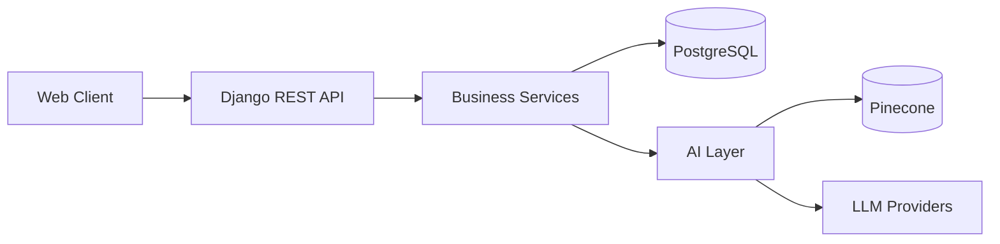
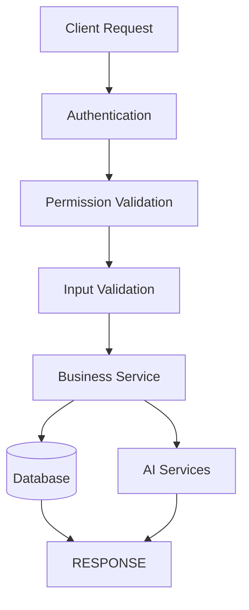
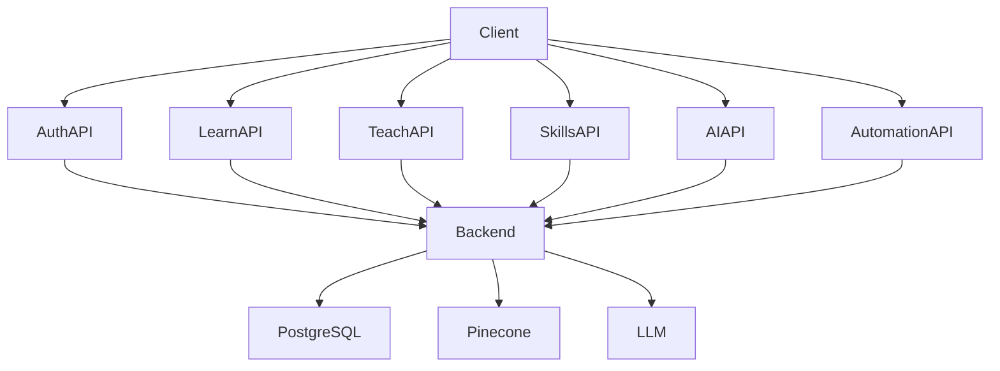

# API Architecture

---

# 1. Introduction

## 1.1 Purpose

This document defines the API architecture of the N.O.V.A. platform. It describes how clients communicate with backend services, the API design principles, communication patterns, authentication mechanisms, versioning strategy, and error handling.

The API architecture provides a stable contract between frontend applications, AI services, and backend business modules.

---

# 2. API Design Principles

The N.O.V.A. APIs are designed according to the following principles:

* RESTful Design
* Resource-Oriented Architecture
* Stateless Communication
* Versioned APIs
* Secure by Default
* Consistent Response Format
* Standard HTTP Status Codes
* Backward Compatibility
* Clear Separation of Business Domains

---

# 3. Communication Model

The platform follows a Client–Server architecture.



---

# 4. API Organization

The APIs are grouped by business capability.

Primary API domains include:

* Authentication API
* Learn API
* Teach API
* Skills API
* Automation API
* Analytics API
* AI API
* Notification API

Each domain owns its own endpoints and business logic.

---

# 5. API Versioning

Versioning shall be included within the URL.

Example:

```
/api/v1/auth/login
/api/v1/learn/chat
/api/v1/teach/courses
```

Future versions may coexist with previous versions to maintain backward compatibility.

---

# 6. Authentication

Protected endpoints require authentication.

Supported authentication methods:

* JWT Access Token
* Refresh Token
* Google OAuth

Authentication shall occur before request processing.

---

# 7. Authorization

Authorization is permission-based.

Every protected endpoint validates:

* User Identity
* Assigned Roles
* Granted Permissions
* Institution Membership

Unauthorized requests shall return HTTP 403 Forbidden.

---

# 8. Request Lifecycle

Every request follows the same processing pipeline.



---

# 9. Response Format

Successful responses follow a standardized structure.

Example:

```json
{
  "success": true,
  "message": "Operation completed successfully.",
  "data": {}
}
```

Error responses follow the same structure.

```json
{
  "success": false,
  "message": "Validation failed.",
  "errors": []
}
```

---

# 10. Error Handling

Common HTTP status codes:

| Status | Meaning               |
| ------ | --------------------- |
| 200    | Success               |
| 201    | Created               |
| 204    | No Content            |
| 400    | Bad Request           |
| 401    | Unauthorized          |
| 403    | Forbidden             |
| 404    | Not Found             |
| 409    | Conflict              |
| 422    | Validation Error      |
| 429    | Too Many Requests     |
| 500    | Internal Server Error |

All errors shall return structured responses.

---

# 11. Pagination

Collection endpoints shall support pagination.

Standard query parameters:

* page
* page_size
* sort
* filter
* search

Large datasets shall never be returned in a single response.

---

# 12. Filtering & Search

Collection endpoints may support:

* Keyword Search
* Metadata Filters
* Date Filters
* Institution Filters
* Course Filters
* Sorting

Filtering improves performance and usability.

---

# 13. File Upload API

The platform supports uploading:

* PDF Documents
* Images
* Presentations
* Videos
* Certificates

Uploads are validated before storage.

Metadata is stored in PostgreSQL while files are stored in Object Storage.

---

# 14. AI Endpoints

AI-specific endpoints include:

* Academic Chat
* Quiz Generation
* Recommendation Requests
* Confidence Evaluation
* Lecturer Escalation

Business modules communicate with the AI layer through these APIs.

---

# 15. WebSocket Support

Real-time communication is used for:

* Live Lectures
* AI Streaming Responses
* Notifications
* Classroom Events

Future versions may expand WebSocket usage.

---

# 16. Rate Limiting

To protect system resources:

* Authentication endpoints shall be rate-limited.
* AI endpoints shall enforce request quotas.
* Upload endpoints shall enforce file size limits.

Rate limits may vary by user role.

---

# 17. API Security

Security measures include:

* HTTPS Enforcement
* JWT Authentication
* Input Validation
* Output Sanitization
* CSRF Protection (where applicable)
* Rate Limiting
* Audit Logging

Sensitive endpoints require additional permission validation.

---

# 18. API Component Diagram



---

# Architecture Decision Record

## AD-007 – RESTful API Architecture

### Status

Accepted

---

### Context

The N.O.V.A. platform requires a consistent communication mechanism between frontend clients, AI services, and backend modules.

The API must remain understandable, secure, scalable, and easy to maintain.

---

### Decision

The platform shall expose RESTful APIs using Django REST Framework.

Endpoints shall be grouped by business domain and follow resource-oriented naming conventions.

---

### Alternatives Considered

**GraphQL**

Advantages

* Flexible queries
* Reduced over-fetching

Disadvantages

* Increased implementation complexity
* More difficult caching
* Less familiar to many developers

---

### Rationale

REST provides simplicity, mature tooling, broad ecosystem support, and aligns well with the Modular Monolith architecture.

---

### Consequences

Positive

* Easy integration
* Clear resource organization
* Strong tooling support
* Straightforward documentation

Negative

* Some endpoints may return more data than required.
* Future GraphQL support may still be considered.

---

# 19. Future Evolution

Future API enhancements may include:

* GraphQL Gateway
* Public Developer API
* Webhooks
* gRPC Internal Communication
* AI Streaming API
* OpenAPI 3.1 Specification
* SDKs for Multiple Programming Languages
