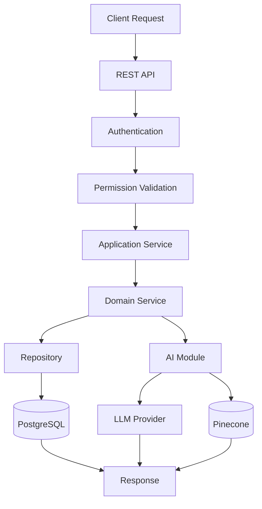

# Backend Architecture

---

# 1. Introduction

## 1.1 Purpose

This document defines the backend architecture of the N.O.V.A. platform. It describes the internal organization of the backend application, software layers, module responsibilities, communication flow, and implementation strategy.

The backend architecture is designed around the principles established in the System Architecture and Component Architecture documents while maintaining a Modular Monolith architecture.

---

# 2. Architectural Style

The backend follows a **Layered Modular Monolith** architecture.

Each business module is implemented independently while remaining part of a single Django application.

The backend separates responsibilities into multiple logical layers.

---

# 3. Backend Layers

The backend consists of the following layers.

## Presentation Layer

Responsible for receiving HTTP requests and returning responses.

Components include:

* Django REST Framework Views
* API Routers
* Request Validation
* Response Serialization

---

## Application Layer

Coordinates application workflows.

Responsibilities include:

* Request orchestration
* Transaction management
* Calling domain services
* Returning application results

---

## Domain Layer

Contains all business logic.

Examples include:

* Quiz generation rules
* Lecturer escalation workflow
* Skill verification logic
* Knowledge base management
* Learning progress calculations

Business rules shall not depend on frameworks or infrastructure.

---

## Infrastructure Layer

Responsible for communication with external systems.

Examples include:

* PostgreSQL
* Pinecone
* Redis
* SMTP
* Google OAuth
* Object Storage
* LLM Providers
* Automation Providers

---

# 4. Backend Modules

The backend is divided into independent modules.

```
Authentication

Learn

Teach

Skills

Automation

Analytics

AI

Notifications

Shared Core
```

Each module owns its:

* Models
* Services
* Serializers
* Views
* URLs
* Business Rules
* Tests

---

# 5. Suggested Project Structure

```
backend/

apps/

authentication/

learn/

teach/

skills/

automation/

analytics/

ai/

notifications/

shared/

config/

requirements/

tests/

manage.py
```

Each application shall remain self-contained.

---

# 6. Internal Module Structure

Each module follows the same organization.

Example:

```
learn/

models.py

views.py

serializers.py

services.py

repositories.py

permissions.py

urls.py

tasks.py

validators.py

signals.py

tests/

migrations/
```

This standardized layout simplifies maintenance and onboarding.

---

# 7. Request Processing Flow

Every request follows a common processing pipeline.

```
Client Request

↓

API Endpoint

↓

Authentication

↓

Permission Validation

↓

Input Validation

↓

Application Service

↓

Domain Service

↓

Repository

↓

Database

↓

Response
```

No business logic shall exist within API views.

---

# 8. Service Layer

The Service Layer contains application-specific workflows.

Examples:

Authentication Service

Quiz Service

Lecture Service

Recommendation Service

Portfolio Service

Workflow Service

Notification Service

The Service Layer coordinates multiple repositories while enforcing business rules.

---

# 9. Repository Layer

Repositories abstract database access.

Responsibilities include:

* CRUD Operations
* Query Optimization
* Pagination
* Filtering
* Search
* Transaction Support

Business logic shall never appear inside repositories.

---

# 10. Background Processing

Long-running operations shall execute asynchronously.

Examples:

* Resource indexing
* Embedding generation
* Email delivery
* Notification dispatch
* Report generation
* AI analytics
* Knowledge base rebuilding

Recommended implementation:

* Celery
* Redis Message Broker

---

# 11. Event Processing

Important platform events shall be published internally.

Examples:

Course Created

Lecture Started

Resource Uploaded

Quiz Completed

Certificate Verified

Badge Awarded

Student Graduated

Modules may subscribe to events without direct dependencies.

---

# 12. Error Handling Strategy

The backend shall implement centralized exception handling.

Error categories include:

* Validation Errors
* Authentication Errors
* Authorization Errors
* Business Rule Violations
* AI Provider Errors
* Database Errors
* Infrastructure Errors

Every error shall produce a consistent API response format.

---

# 13. Logging Strategy

The backend shall record:

* API Requests
* Authentication Events
* AI Requests
* Workflow Execution
* Database Errors
* Security Events
* Performance Metrics

Logs shall support debugging and auditing.

---

# 14. Configuration Management

Configuration shall remain externalized.

Examples:

Database URL

JWT Secret

OAuth Credentials

Pinecone API Key

LLM API Keys

SMTP Configuration

Redis URL

Secrets shall never be committed to source control.

---

# 15. Dependency Rules

Modules shall communicate only through service interfaces.

Forbidden dependencies include:

* Learn accessing Teach internals.
* Skills modifying Authentication data directly.
* Automation bypassing Service Layer.
* AI modifying database records directly.

This preserves modularity.

---

# 16. Backend Communication Diagram



---

# Architecture Decision Record

## AD-003 — Layered Backend Architecture

### Status

Accepted

---

### Context

The backend must remain maintainable as additional modules and AI capabilities are introduced.

Without clear architectural layers, business logic would become tightly coupled with framework code and infrastructure.

---

### Decision

The backend shall follow a layered architecture consisting of:

* Presentation Layer
* Application Layer
* Domain Layer
* Infrastructure Layer

Business rules shall remain framework-independent.

---

### Alternatives Considered

**Traditional MVC**

Advantages

* Simpler structure
* Faster initial development

Disadvantages

* Business logic tends to accumulate in views and models.
* Difficult to maintain as complexity grows.

---

### Rationale

Layered Architecture provides clear separation of concerns, improved testability, easier maintenance, and better long-term scalability while remaining compatible with Django.

---

### Consequences

Positive

* Cleaner code organization.
* Improved testing.
* Easier onboarding.
* Better maintainability.

Negative

* Slightly more files.
* Additional abstraction.

The architecture prioritizes long-term maintainability over minimal file count.

---

# 17. Future Evolution

Future improvements may include:

* Event Bus
* CQRS
* Domain Events
* Message Queue Integration
* Microservice Extraction
* GraphQL Gateway
* AI Service Isolation

These enhancements can be introduced without significant architectural redesign due to the modular backend structure.
