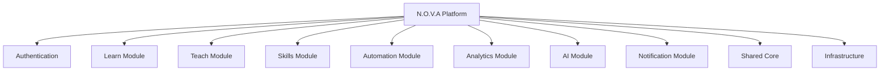

# Component Architecture

---

# 1. Introduction

## 1.1 Purpose

This document defines the internal software components that constitute the N.O.V.A. platform. It describes the responsibilities, boundaries, dependencies, and interactions between major software modules.

The objective is to establish a modular software structure that supports maintainability, scalability, testability, and future evolution while remaining suitable for a Modular Monolith architecture.

---

# 2. Component Overview

The N.O.V.A. platform consists of the following primary software components.

* Authentication
* Learn
* Teach
* Skills
* Automation
* Analytics
* AI
* Notification
* Shared Core
* Infrastructure

Each component encapsulates a specific business capability and communicates with other components through clearly defined interfaces.

---

# 3. Component Diagram

---

# 4. Authentication Component

## Responsibilities

* User Authentication
* JWT Generation
* Google OAuth
* Session Management
* Role-Based Access Control
* Permission Validation
* User Identity Management

---

## Internal Services

* Authentication Service
* Authorization Service
* JWT Service
* OAuth Service
* Permission Service
* Audit Service

---

## Dependencies

Depends on:

* PostgreSQL

Provides services to:

* Learn
* Teach
* Skills
* Automation
* Analytics
* AI

---

# 5. Learn Component

## Responsibilities

The Learn component provides AI-assisted educational services for students.

Major capabilities include:

* AI Chat
* Quiz Generation
* Learning Progress
* Personalized Recommendations
* Conversation History
* Learning Analytics

---

## Internal Services

* Conversation Service
* Quiz Service
* Progress Service
* Recommendation Service
* History Service

---

## Dependencies

Requires:

* AI Module
* PostgreSQL
* Pinecone

---

## Used By

* Student Portal

---

# 6. Teach Component

## Responsibilities

Supports lecturers throughout the teaching lifecycle.

Capabilities include:

* Course Management
* Resource Upload
* Knowledge Base Management
* Live Lecture
* Classroom Interaction
* Teaching Dashboard

---

## Internal Services

* Course Service
* Lecture Service
* Knowledge Service
* Dashboard Service
* Analytics Service

---

## Dependencies

Requires

* AI Module
* PostgreSQL
* Pinecone
* Notification Module

---

# 7. Skills Component

## Responsibilities

Manages professional development records.

Capabilities include

* Certificates
* Skill Passport
* Badge System
* Portfolio
* Resume Generation
* Employer Profile

---

## Internal Services

* Certificate Service
* Badge Service
* Portfolio Service
* Resume Service
* Skill Verification Service

---

## Dependencies

Requires

* PostgreSQL
* Object Storage

---

# 8. Automation Component

## Responsibilities

Executes academic workflow automation.

Capabilities include

* Workflow Automation
* Event Processing
* Notification Triggers
* Academic Automation
* Third-Party Integrations

---

## Internal Services

* Workflow Engine
* Trigger Engine
* Scheduler
* Integration Service

---

## Dependencies

Requires

* Notification Module
* AI Module

---

# 9. Analytics Component

## Responsibilities

Generates institutional insights.

Capabilities include

* Student Analytics
* Teaching Analytics
* Course Analytics
* Platform Analytics
* AI Analytics

---

## Internal Services

* Reporting Service
* Dashboard Service
* Metrics Service

---

## Dependencies

Requires

* PostgreSQL
* AI Module

---

# 10. AI Component

The AI component represents the intelligence layer of N.O.V.A.

It coordinates multiple specialized AI agents responsible for educational tasks.

---

## Internal Components

* AI Orchestrator
* RAG Engine
* Quiz Generation Agent
* Recommendation Agent
* Confidence Evaluation Engine
* Escalation Engine
* Prompt Manager

---

## Responsibilities

* Query Processing
* Context Retrieval
* AI Response Generation
* Prompt Management
* Confidence Evaluation
* Citation Generation
* Lecturer Escalation

---

## Dependencies

Requires

* Pinecone
* LLM Provider Layer
* PostgreSQL

---

# 11. Notification Component

Provides communication services.

Capabilities include

* Email
* In-App Notifications
* Push Notifications (Future)
* Workflow Alerts
* Academic Alerts

---

## Internal Services

* Notification Service
* Email Service
* Alert Service

---

# 12. Shared Core

Contains common functionality used throughout the platform.

Includes

* UUID Generation
* Configuration
* Utility Classes
* Common DTOs
* Shared Exceptions
* Validation
* Constants

---

# 13. Infrastructure Component

Responsible for operational support.

Includes

* Docker
* Nginx
* Redis
* PostgreSQL
* Pinecone
* Object Storage
* Monitoring
* Logging
* CI/CD

---

# 14. Component Dependency Matrix

| Component      | Depends On                              |
| -------------- | --------------------------------------- |
| Authentication | PostgreSQL                              |
| Learn          | AI, PostgreSQL, Pinecone                |
| Teach          | AI, PostgreSQL, Pinecone, Notifications |
| Skills         | PostgreSQL, Object Storage              |
| Automation     | AI, Notifications                       |
| Analytics      | PostgreSQL, AI                          |
| AI             | Pinecone, PostgreSQL, LLM               |
| Notifications  | SMTP Provider                           |
| Shared Core    | None                                    |

---

# Architecture Decision Record

## AD-002 — Component-Based Modular Design

### Status

Accepted

---

### Context

The N.O.V.A. platform consists of numerous business capabilities that must remain maintainable throughout long-term development.

Without clear component boundaries, software complexity would increase significantly as new functionality is introduced.

---

### Decision

The platform shall organize all business capabilities into independent software components.

Each component shall own its business logic, expose well-defined interfaces, and avoid unnecessary dependencies on unrelated components.

---

### Rationale

A component-based architecture improves:

* Maintainability
* Testability
* Readability
* Scalability
* Team collaboration

while preserving the simplicity of a Modular Monolith deployment.

---

### Consequences

Positive

* Reduced coupling
* Clear ownership
* Easier maintenance
* Better testing

Negative

* Slight increase in architectural planning.
* Additional abstraction compared to a traditional monolith.

The long-term benefits outweigh the initial design effort.

---

# 15. Future Evolution

The current component structure is designed to support future migration toward microservices if required.

Candidate components for future extraction include:

* AI Module
* Notification Module
* Analytics Module
* Automation Module

No architectural redesign would be required due to the existing modular boundaries.

