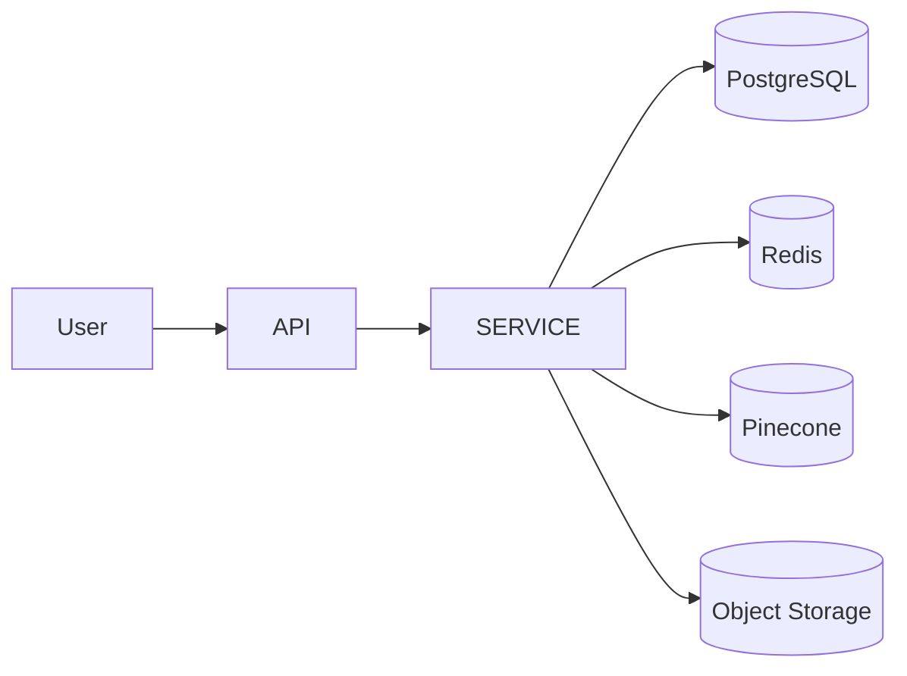
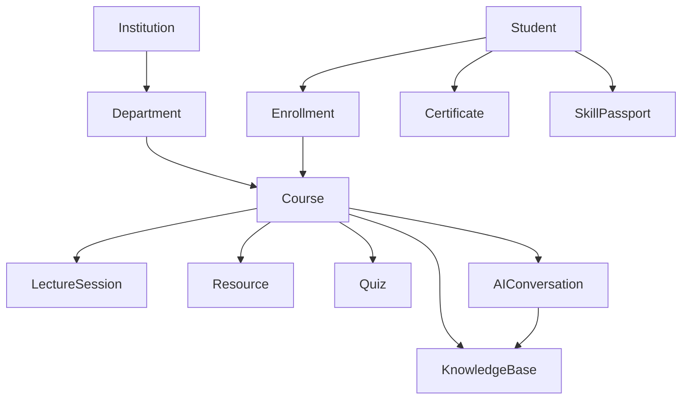

# Database Architecture

---

# 1. Introduction

## 1.1 Purpose

This document defines the database architecture of the N.O.V.A. platform. It describes the persistence strategy, database technologies, logical organization of data, storage responsibilities, and architectural decisions governing data management.

The database architecture supports the Modular Monolith backend while ensuring scalability, data integrity, security, and maintainability.

---

# 2. Database Strategy

N.O.V.A. adopts a **polyglot persistence architecture**, where multiple storage technologies are used based on the nature of the data.

The platform does not rely on a single database for all workloads.

Instead, each storage technology is selected according to its strengths.

---

# 3. Storage Technologies

| Storage Type        | Technology            | Purpose                   |
| ------------------- | --------------------- | ------------------------- |
| Relational Database | PostgreSQL            | Business data             |
| Vector Database     | Pinecone              | AI knowledge retrieval    |
| Cache               | Redis                 | Temporary data & sessions |
| Object Storage      | S3 Compatible Storage | Files & resources         |

---

# 4. Relational Database (PostgreSQL)

PostgreSQL serves as the primary source of truth for structured platform data.

Responsibilities include:

* User Accounts
* Institutions
* Departments
* Courses
* Lecture Sessions
* Quiz Results
* Certificates
* Skill Passport
* Notifications
* Audit Logs
* Workflow Metadata

The relational database enforces transactional consistency and referential integrity.

---

# 5. Vector Database (Pinecone)

Pinecone stores vector embeddings used by the Retrieval-Augmented Generation (RAG) subsystem.

Responsibilities include:

* Course Knowledge Embeddings
* Lecture Notes
* PDF Chunks
* Video Transcript Chunks
* AI Search Index

The vector database shall not store authoritative business records.

---

# 6. Cache Layer (Redis)

Redis improves system performance by storing frequently accessed temporary data.

Typical cached information includes:

* User Sessions
* Authentication Tokens
* Frequently Accessed Queries
* AI Response Cache
* Rate Limiting Counters
* Background Task Queues

Cached data shall remain disposable.

---

# 7. Object Storage

Object storage maintains binary assets and large files.

Examples include:

* PDFs
* Images
* Presentation Files
* Lecture Videos
* Generated Reports
* Certificates

Metadata for these files shall remain in PostgreSQL.

---

# 8. Logical Data Domains

The database is organized into several logical domains.

## Identity Domain

Stores:

* Users
* Roles
* Permissions
* Authentication Records

---

## Academic Domain

Stores:

* Institutions
* Departments
* Courses
* Lecture Sessions
* Student Enrollment

---

## Learning Domain

Stores:

* Quiz Results
* Learning Progress
* Recommendations
* AI Conversations

---

## Skills Domain

Stores:

* Certificates
* Badges
* Skill Passport
* Portfolio Metadata

---

## Automation Domain

Stores:

* Workflow Definitions
* Execution History
* Scheduled Jobs

---

## Analytics Domain

Stores:

* Metrics
* Dashboards
* Aggregated Reports

---

# 9. Data Ownership

Each software component owns its own data.

Example:

| Component      | Owned Data              |
| -------------- | ----------------------- |
| Authentication | Users, Roles            |
| Learn          | Conversations, Progress |
| Teach          | Courses, Lectures       |
| Skills         | Certificates, Portfolio |
| Automation     | Workflows               |
| Analytics      | Reports                 |

Components shall not modify another component's data directly.

Communication shall occur through service interfaces.

---

# 10. Data Flow

---

# 11. Database Integrity

The architecture enforces:

* Primary Keys
* Foreign Keys
* Unique Constraints
* Transactions
* Cascading Rules
* Optimistic Locking (where appropriate)

This ensures consistency across academic records.

---

# 12. Backup Strategy

The platform shall support:

* Automated Daily Backups
* Incremental Backups
* Point-in-Time Recovery
* Backup Verification
* Disaster Recovery Procedures

Object storage and vector indexes shall be backed up independently.

---

# 13. Security

Sensitive information shall be protected through:

* Encryption at Rest
* Encryption in Transit
* Role-Based Access Control
* Audit Logging
* Secure Database Credentials
* Principle of Least Privilege

---

# 14. Performance Optimization

Performance strategies include:

* Database Indexing
* Query Optimization
* Pagination
* Lazy Loading
* Caching
* Connection Pooling

Vector searches shall remain isolated from transactional workloads.

---

# 15. Multi-Tenant Architecture

Each institution remains logically isolated.

Every institution owns:

* Departments
* Courses
* Students
* Lecturers
* Knowledge Bases
* Analytics

All queries shall enforce institution boundaries.

---

# 16. Database Diagram

---

# Architecture Decision Record

## AD-004 – Polyglot Persistence

### Status

Accepted

---

### Context

The N.O.V.A. platform stores structured business data, vector embeddings, temporary cached information, and large binary assets.

Using a single database technology would introduce unnecessary complexity and reduce performance.

---

### Decision

The platform shall adopt Polyglot Persistence.

Different storage technologies shall be used according to the characteristics of the data.

---

### Rationale

PostgreSQL excels at relational consistency.

Pinecone provides efficient semantic retrieval.

Redis delivers high-performance caching.

Object Storage efficiently stores large binary assets.

Each technology is used for the workload it handles best.

---

### Consequences

Positive

* Better scalability
* Improved performance
* Easier maintenance
* Separation of responsibilities

Negative

* Additional operational complexity.
* Multiple storage systems require monitoring.

The long-term benefits outweigh the additional infrastructure requirements.

---

# 17. Future Evolution

Future enhancements may include:

* Read Replicas
* Database Sharding
* Multi-Region Replication
* Time-Series Database for Analytics
* Data Warehouse Integration
* Lakehouse Architecture
* AI Feature Store
