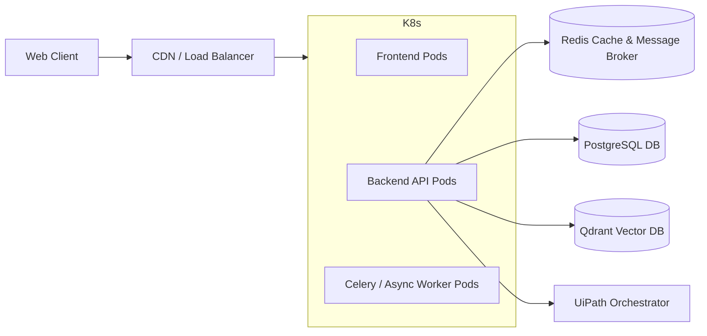

# Deployment Architecture

## 1. Target Infrastructure
N.O.V.A. is deployed as a secure, containerized web application suitable for cloud or on-premise institutional hosting.

## 2. Infrastructure Diagram

