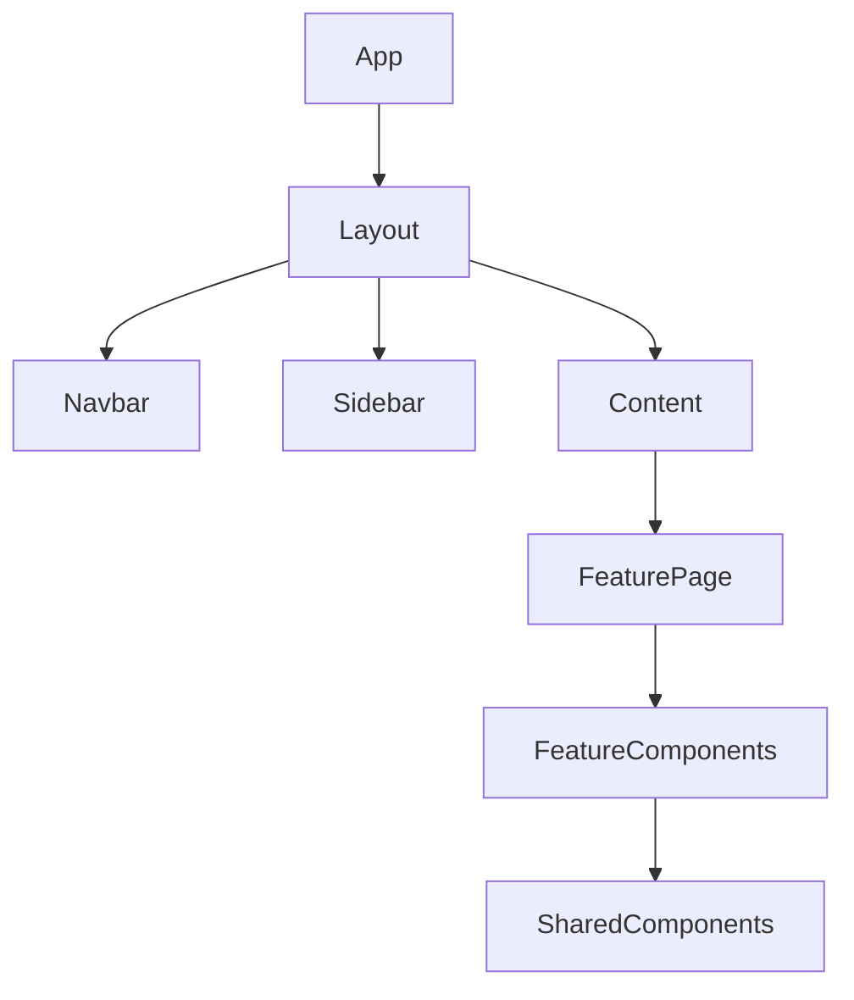
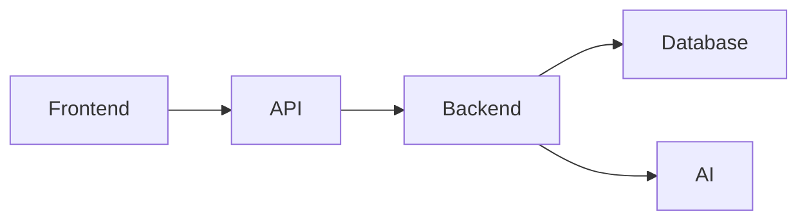
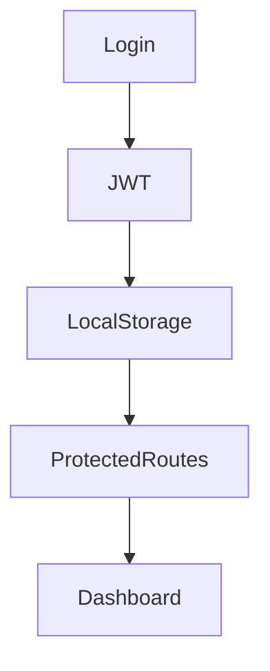
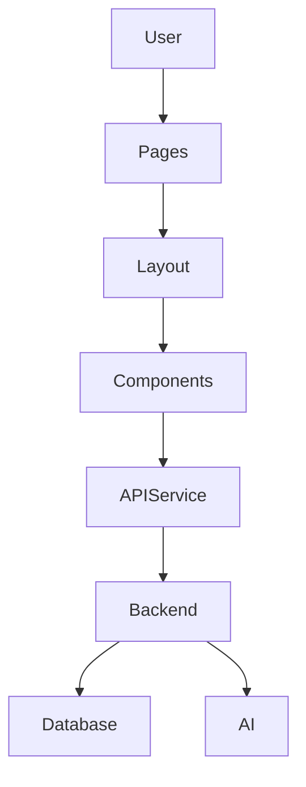

# Frontend Architecture

---

# 1. Introduction

## 1.1 Purpose

This document defines the frontend architecture of the N.O.V.A. platform. It describes the structure, organization, communication model, state management strategy, routing, component hierarchy, and architectural principles governing the web application.

The frontend architecture is designed to provide a scalable, maintainable, responsive, and accessible user experience while remaining independent of backend implementation details.

---

# 2. Technology Stack

| Layer            | Technology         |
| ---------------- | ------------------ |
| Framework        | Next.js 15         |
| Language         | TypeScript         |
| UI Library       | React              |
| Styling          | Tailwind CSS       |
| Icons            | Lucide React       |
| Forms            | React Hook Form    |
| Validation       | Zod                |
| API Client       | Axios              |
| State Management | Zustand            |
| Authentication   | JWT + Google OAuth |
| Charts           | Recharts           |

---

# 3. Design Principles

The frontend follows these principles:

* Component-Based Design
* Responsive Layouts
* Accessibility First
* Reusable UI Components
* Separation of UI and Business Logic
* API-Driven Communication
* Modular Folder Structure
* Minimal Client State

---

# 4. Application Structure

The frontend is organized into feature-based modules.

```text
frontend/

app/

components/

features/

hooks/

lib/

services/

stores/

types/

utils/

public/
```

Each feature owns its components, hooks, and services.

---

# 5. Major Features

The frontend provides interfaces for:

* Authentication
* Student Dashboard
* Lecturer Dashboard
* Institution Dashboard
* Learn Module
* Teach Module
* Skills Module
* Automation Module
* Analytics
* Settings

Each feature remains independent.

---

# 6. Routing Strategy

Next.js App Router shall be used.

Example routes:

```text
/

login

dashboard

learn

teach

skills

automation

analytics

settings
```

Protected routes require authentication.

---

# 7. Component Hierarchy



The layout system ensures consistency across all modules.

---

# 8. State Management

Frontend state is divided into:

Global State

* User
* Authentication
* Theme
* Notifications

Local State

* Forms
* Modals
* Tables
* Search
* Filters

Persistent State

* Session
* Preferences

The architecture minimizes unnecessary global state.

---

# 9. API Communication

The frontend communicates exclusively through REST APIs.



Business logic shall not exist within frontend components.

---

# 10. Authentication Flow

Authentication uses JWT.

Workflow:



Expired tokens are refreshed using Refresh Tokens.

---

# 11. Error Handling

Common frontend errors include:

* Validation Errors
* Network Failures
* Authentication Errors
* API Errors
* AI Service Errors

Errors shall display user-friendly messages while logging technical details for debugging.

---

# 12. Responsive Design

The interface shall support:

* Desktop
* Laptop
* Tablet
* Mobile

Layouts shall adapt using responsive breakpoints provided by Tailwind CSS.

---

# 13. Accessibility

The platform aims to follow WCAG guidelines by providing:

* Keyboard Navigation
* Semantic HTML
* Sufficient Color Contrast
* Screen Reader Compatibility
* Focus Indicators
* Accessible Forms

---

# 14. Performance Optimization

Performance techniques include:

* Lazy Loading
* Code Splitting
* Image Optimization
* Memoization
* Dynamic Imports
* API Response Caching

These optimizations improve perceived responsiveness.

---

# 15. Security Considerations

Frontend security includes:

* Protected Routes
* Secure Token Storage
* Input Validation
* Output Encoding
* CSRF Protection (where applicable)
* Content Security Policy

Sensitive business logic remains on the backend.

---

# 16. Frontend Component Diagram



---

# Architecture Decision Record

## AD-008 – Component-Based Frontend

### Status

Accepted

---

### Context

The frontend must remain scalable while supporting multiple user roles and modules.

Without reusable components, duplication and maintenance effort would increase.

---

### Decision

The frontend shall adopt a component-based architecture using React and Next.js.

Business logic shall remain separated from presentation logic.

---

### Rationale

Reusable components improve consistency, maintainability, testing, and development speed.

---

### Consequences

Positive

* Better maintainability
* Reusable UI
* Faster development
* Improved testing

Negative

* Initial design effort
* Larger component library

The long-term benefits outweigh the additional planning.

---

# 17. Future Evolution

Future frontend improvements may include:

* Progressive Web App (PWA)
* Mobile Application
* Offline Support
* Dark/Light Theme Customization
* AI Voice Interface
* Real-Time Collaboration
* Widget Marketplace
