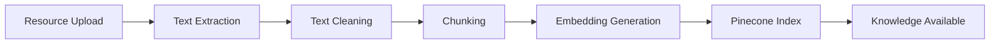
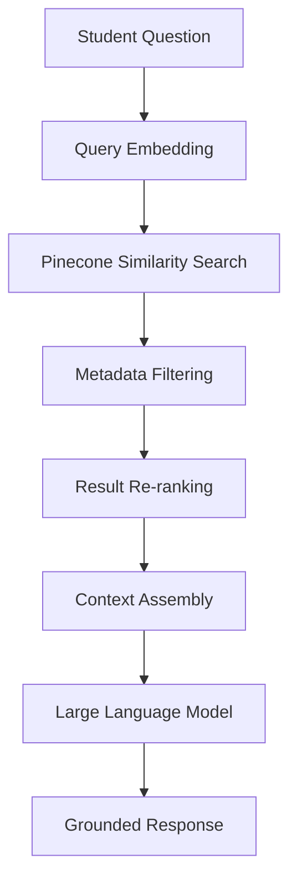
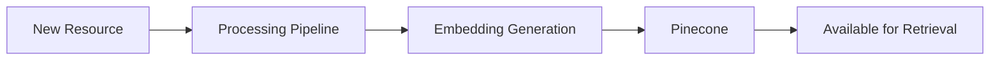
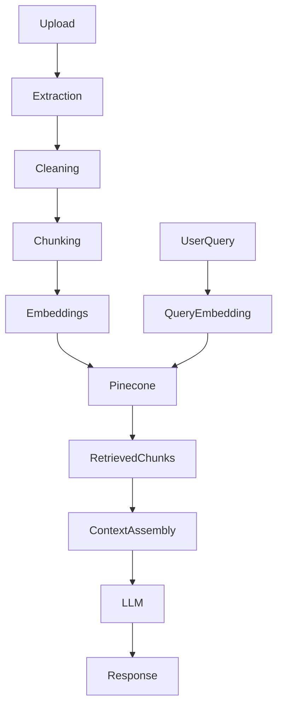

# RAG Architecture

---

# 1. Introduction

## 1.1 Purpose

This document defines the Retrieval-Augmented Generation (RAG) architecture of the N.O.V.A. platform. It describes how institutional knowledge is ingested, indexed, retrieved, and supplied to Large Language Models (LLMs) to generate accurate, contextual, and explainable responses.

The RAG architecture ensures that AI responses are grounded in lecturer-approved academic resources rather than relying solely on the model's pre-trained knowledge.

---

# 2. Objectives

The objectives of the RAG subsystem are to:

* Improve factual accuracy.
* Reduce AI hallucinations.
* Prioritize institution-approved knowledge.
* Generate responses with supporting citations.
* Support continuous knowledge updates.
* Enable scalable semantic search.

---

# 3. Knowledge Sources

The RAG pipeline processes multiple academic resources.

Supported knowledge sources include:

* Lecture Notes
* PDF Documents
* Presentation Slides
* Course Handbooks
* Assignment Solutions
* Question Banks
* Video Transcripts
* Lecturer Notes
* Frequently Asked Questions

Future versions may support:

* External Research Papers
* Institutional Policies
* LMS Content Synchronization

---

# 4. Knowledge Ingestion Pipeline

Academic resources follow a standardized ingestion workflow before becoming available for retrieval.

---

# 5. Text Processing

Before indexing, uploaded documents undergo preprocessing.

Processing steps include:

* Text Extraction
* Metadata Extraction
* Noise Removal
* Whitespace Normalization
* Header/Footer Removal
* Language Detection
* Content Validation

Only valid academic content proceeds to indexing.

---

# 6. Chunking Strategy

Large documents are divided into smaller semantic chunks.

Chunking objectives include:

* Preserve contextual meaning.
* Minimize information loss.
* Improve retrieval accuracy.
* Reduce token consumption.

Recommended strategy:

* Recursive Character Text Splitting
* Configurable Chunk Size
* Configurable Overlap

Each chunk retains associated metadata.

---

# 7. Embedding Generation

Each chunk is converted into a vector representation.

The embedding layer remains provider-independent.

Supported embedding models include:

* Multi-QA MiniLM
* Multi-QA MPNet
* BGE-M3
* E5 Models
* OpenAI Embeddings (Future)

Embedding model selection shall be configurable without requiring application code changes.

---

# 8. Vector Database

Pinecone serves as the vector storage layer.

Responsibilities include:

* Storing Embeddings
* Similarity Search
* Metadata Filtering
* Namespace Isolation
* Fast Semantic Retrieval

Each institution maintains logically isolated knowledge namespaces.

---

# 9. Retrieval Pipeline

When a user submits an academic question, the retrieval workflow is executed.

---

# 10. Metadata Filtering

Retrieval considers both semantic similarity and structured metadata.

Examples include:

* Institution
* Department
* Course
* Semester
* Subject
* Lecturer
* Resource Type
* Academic Year

Metadata filtering improves retrieval precision.

---

# 11. Re-ranking

Retrieved documents may be re-ranked before context assembly.

Possible approaches include:

* Cross Encoder Models
* Reciprocal Rank Fusion (Future)
* Hybrid Retrieval (Future)

Re-ranking improves context relevance while reducing noise.

---

# 12. Context Assembly

The retrieved chunks are combined into a structured context before being sent to the LLM.

Context assembly includes:

* Removing duplicate chunks
* Ordering by relevance
* Token limit enforcement
* Metadata preservation
* Citation tracking

Only the most relevant information is forwarded to the AI model.

---

# 13. Citation Generation

Every grounded response should include references whenever applicable.

References may include:

* Document Title
* Section
* Page Number
* Lecturer
* Course

This improves transparency and trustworthiness.

---

# 14. Knowledge Updates

The knowledge base supports continuous updates.

Update workflow:

Knowledge updates shall not interrupt platform availability.

---

# 15. Performance Optimization

Performance strategies include:

* Batch Embedding Generation
* Parallel Indexing
* Cached Query Embeddings
* Metadata Filtering
* Connection Pooling
* Efficient Chunk Sizes

These optimizations reduce latency and operational cost.

---

# 16. Error Handling

Possible failure scenarios include:

* Embedding Provider Failure
* Pinecone Unavailable
* Empty Retrieval Results
* Invalid Documents
* Corrupted Resources
* Token Limit Exceeded

The AI layer shall gracefully handle retrieval failures and provide appropriate fallback behavior.

---

# 17. RAG Component Diagram

---

# Architecture Decision Record

## AD-006 – Retrieval-Augmented Generation

### Status

Accepted

---

### Context

Large Language Models may generate inaccurate or outdated information when relying solely on their pre-trained knowledge.

Educational platforms require responses to be grounded in institution-approved academic resources.

---

### Decision

N.O.V.A. shall adopt a Retrieval-Augmented Generation (RAG) architecture.

All academic responses shall be generated using retrieved institutional knowledge whenever applicable.

---

### Alternatives Considered

**Pure LLM Responses**

Advantages

* Simpler implementation
* Lower infrastructure complexity

Disadvantages

* Higher hallucination risk
* Limited explainability
* No institutional grounding

---

### Rationale

The RAG architecture significantly improves response accuracy, transparency, and trust by grounding AI outputs in lecturer-approved academic resources.

---

### Consequences

Positive

* Reduced hallucinations
* Explainable responses
* Citation support
* Updatable knowledge without model retraining
* Institution-specific answers

Negative

* Additional infrastructure requirements
* Increased indexing complexity
* Slightly higher response latency

The educational benefits justify the additional architectural complexity.

---

# 18. Future Evolution

Future enhancements may include:

* Hybrid Search (BM25 + Vector Search)
* Cross-Encoder Re-ranking
* Knowledge Graph Integration
* Incremental Index Updates
* Multi-Modal Retrieval (Text, Images, Audio)
* Personalized Retrieval based on Learning History
* Federated Knowledge Bases across Institutions
