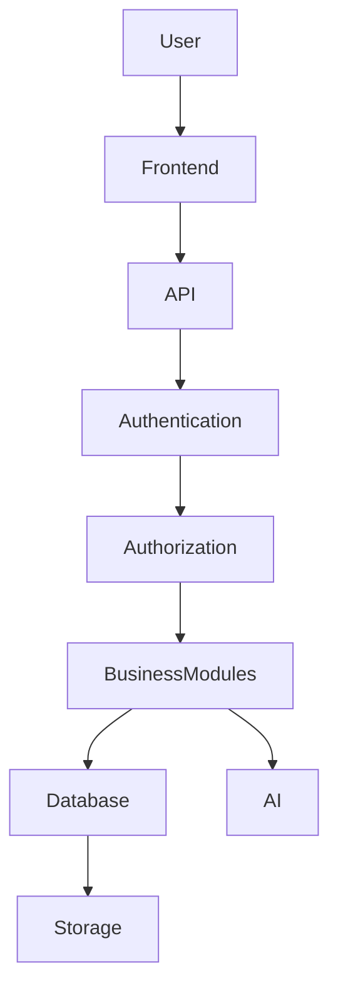
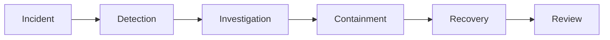
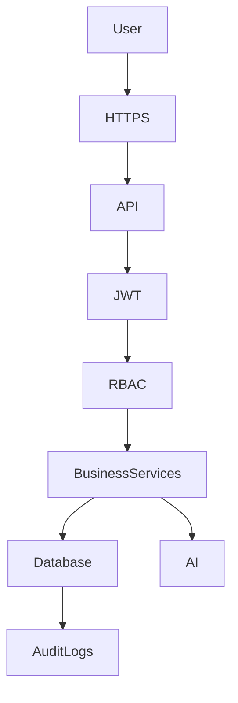

# Security Architecture

---

# 1. Introduction

## 1.1 Purpose

This document defines the security architecture of the N.O.V.A. platform. It describes the security principles, authentication mechanisms, authorization model, data protection strategy, AI security considerations, infrastructure security, and operational controls used to protect the platform.

Security is treated as an architectural concern and is incorporated into every layer of the system.

---

# 2. Security Principles

The platform follows the following principles:

* Security by Design
* Least Privilege
* Defense in Depth
* Zero Trust
* Secure Defaults
* Encryption Everywhere
* Auditability
* Privacy by Design

---

# 3. Security Layers

Security is implemented across multiple layers.

Each layer performs independent security validation.

---

# 4. Authentication

Supported authentication methods include:

* Email & Password
* Google OAuth
* JWT Access Tokens
* Refresh Tokens

Future support:

* Microsoft Entra ID
* LDAP
* Institution Single Sign-On (SSO)

Authentication is mandatory before accessing protected resources.

---

# 5. Authorization

Authorization follows a permission-based Role-Based Access Control (RBAC) model.

Supported roles include:

* Student
* Lecturer
* Institution Administrator
* System Administrator

Permissions are validated for every protected operation.

Business modules shall never bypass authorization checks.

---

# 6. Data Protection

Sensitive information is protected using:

* HTTPS
* TLS Encryption
* Password Hashing (Argon2 or bcrypt)
* Database Encryption (where applicable)
* Secure Object Storage
* Encrypted Secrets

Personally identifiable information shall only be accessible to authorized users.

---

# 7. API Security

The API layer implements:

* JWT Validation
* Input Validation
* Output Encoding
* Request Rate Limiting
* CORS Policies
* CSRF Protection (where applicable)
* Secure Headers

All API requests are validated before reaching business services.

---

# 8. AI Security

The AI subsystem introduces additional security requirements.

Measures include:

* Prompt Injection Detection
* Context Validation
* Lecturer-Approved Knowledge Sources
* Confidence Thresholds
* Human-in-the-Loop Escalation
* Prompt Sanitization

AI agents shall never execute arbitrary user instructions outside their defined scope.

---

# 9. Database Security

Database protection includes:

* Role-Based Database Access
* Encrypted Connections
* Backup Encryption
* Query Parameterization
* Least Privilege Accounts
* Audit Logging

Direct database access is prohibited outside authorized backend services.

---

# 10. Infrastructure Security

Infrastructure security includes:

* Docker Image Hardening
* Network Segmentation
* Firewall Rules
* Reverse Proxy (Nginx)
* Secret Management
* Operating System Updates
* Secure CI/CD Pipelines

Infrastructure components shall be regularly patched.

---

# 11. Audit Logging

The platform records security-relevant events including:

* Login Attempts
* Failed Authentication
* Permission Violations
* AI Escalations
* Workflow Execution
* Administrative Actions
* Security Configuration Changes

Audit logs shall be tamper-resistant.

---

# 12. Incident Response

Security incidents shall follow a standard response process.

Lessons learned shall be incorporated into future security improvements.

---

# 13. Privacy

The platform follows privacy-by-design principles.

Student data shall:

* Remain institution-isolated
* Be processed only for authorized purposes
* Support deletion where applicable
* Minimize unnecessary retention

---

# 14. Threat Mitigation

Major threats addressed include:

| Threat              | Mitigation                  |
| ------------------- | --------------------------- |
| SQL Injection       | Parameterized Queries       |
| XSS                 | Output Encoding             |
| CSRF                | CSRF Tokens                 |
| Brute Force         | Rate Limiting               |
| Prompt Injection    | Prompt Validation           |
| Unauthorized Access | RBAC                        |
| Data Leakage        | Encryption & Access Control |
| Session Hijacking   | JWT Expiration & Refresh    |

---

# 15. Security Architecture Diagram

---

# Architecture Decision Record

## AD-009 – Security by Design

### Status

Accepted

---

### Context

N.O.V.A. processes academic records, AI interactions, certificates, and institutional data that require strong protection.

Security mechanisms introduced only during implementation are insufficient.

---

### Decision

Security shall be incorporated into every architectural layer from the beginning of system design.

Authentication, authorization, encryption, auditing, and monitoring shall be mandatory architectural components.

---

### Alternatives Considered

**Reactive Security**

Advantages

* Faster initial development

Disadvantages

* Higher long-term risk
* Difficult retrofitting
* Increased vulnerability

---

### Rationale

A proactive security architecture reduces operational risk and simplifies long-term maintenance while protecting institutional data.

---

### Consequences

Positive

* Improved platform security
* Easier compliance
* Better auditing
* Reduced attack surface

Negative

* Increased implementation effort
* Additional architectural planning

The long-term security benefits justify the additional complexity.

---

# 16. Future Evolution

Future enhancements may include:

* Multi-Factor Authentication (MFA)
* Hardware Security Keys
* Passwordless Authentication
* AI-Based Threat Detection
* Security Information & Event Management (SIEM)
* Continuous Vulnerability Scanning
* Zero-Trust Network Access
