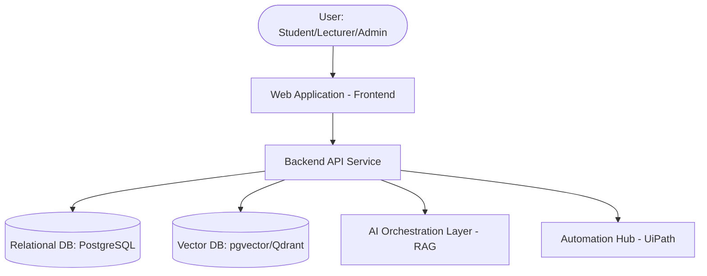

# System Architecture

## 1. High-Level Architecture
Overview of the N.O.V.A. system architecture, including user interfaces, web/application servers, AI layer, automation hub, and data persistence layers.

## 2. Component Diagram

