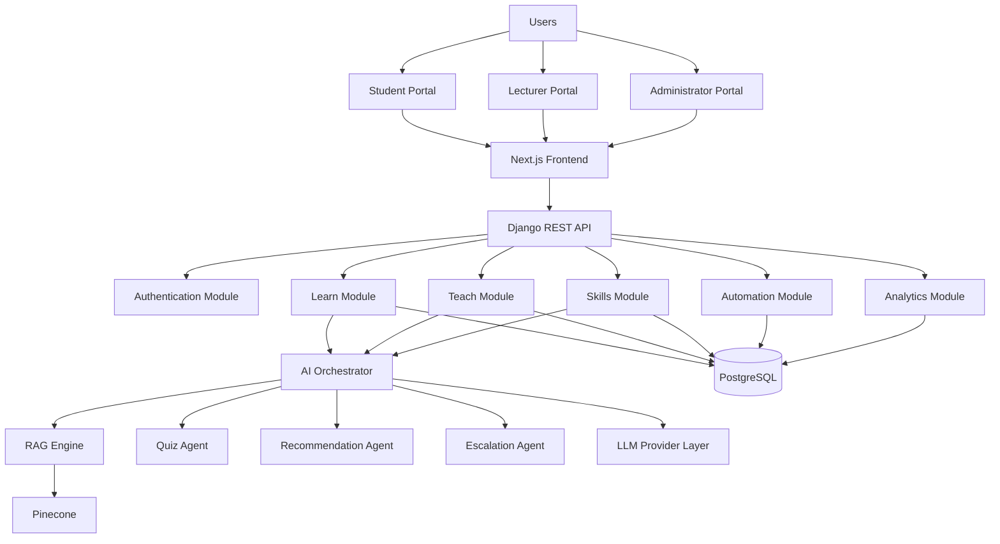

# Software Architecture Document (SAD)

## N.O.V.A.

### Next-Generation Operational Virtual Academic Assistant

---

**Document Version:** v1.0

**Document Status:** Draft

**Prepared By:** Team N.O.V.A.

**Document Type:** Software Architecture Document (SAD)

**Classification:** Internal Technical Documentation

---

# Revision History

| Version | Date          | Author        | Description                            |
| ------- | ------------- | ------------- | -------------------------------------- |
| 0.1     | Initial Draft | Team N.O.V.A. | Architecture outline created           |
| 1.0     | Current       | Team N.O.V.A. | Initial Software Architecture Document |

---

# Approval

| Role          | Name          | Status  |
| ------------- | ------------- | ------- |
| Project Team  | Team N.O.V.A. | Pending |
| Faculty Guide | TBD           | Pending |

---

# Table of Contents

1. Introduction

2. Architectural Goals

3. Architecture Principles

4. Quality Attributes

5. High-Level Architecture

6. Technology Stack

7. Component Architecture

8. Backend Architecture

9. Frontend Architecture

10. AI Multi-Agent Architecture

11. Database Architecture

12. API Architecture

13. Security Architecture

14. Deployment Architecture

15. Monitoring & Logging

16. Scalability Strategy

17. Architecture Decision Records

18. Future Evolution

---

# 1. Introduction

## 1.1 Purpose

This Software Architecture Document (SAD) defines the software architecture of the N.O.V.A. platform. It provides a comprehensive technical blueprint describing the structural organization, architectural principles, software components, technology stack, communication mechanisms, deployment strategy, and design decisions that guide the implementation of the system.

While the Software Requirements Specification (SRS) defines **what** the system must accomplish, this document defines **how** those requirements will be realized through software architecture.

The architecture presented in this document is intended to serve as the primary technical reference throughout the development lifecycle and shall guide software engineers, AI engineers, system architects, DevOps engineers, and testers during implementation.

---

## 1.2 Objectives

The primary objectives of this architecture are to:

* Design a scalable academic platform capable of serving multiple educational institutions.
* Enable modular development while maintaining architectural consistency.
* Support AI-driven educational services through a Multi-Agent Architecture.
* Maintain clear separation between presentation, business logic, artificial intelligence, and infrastructure.
* Minimize coupling between software modules.
* Simplify future maintenance and expansion.
* Support cloud-native deployment.
* Ensure security, reliability, and maintainability throughout the system lifecycle.

---

## 1.3 Scope

This document describes the complete architecture of the N.O.V.A. platform, including:

* High-Level System Architecture
* Frontend Architecture
* Backend Architecture
* AI Architecture
* RAG Architecture
* Database Architecture
* Authentication Architecture
* API Architecture
* Automation Architecture
* Deployment Architecture
* Monitoring Strategy
* Security Strategy
* Scalability Strategy
* Architecture Decision Records (ADRs)

Implementation-level details such as database schemas, API endpoint specifications, and source code are intentionally excluded and will be documented separately.

---

## 1.4 Intended Audience

This document is intended for:

* Software Architects
* Backend Developers
* Frontend Developers
* AI Engineers
* DevOps Engineers
* Quality Assurance Engineers
* Faculty Reviewers
* Technical Stakeholders

---

## 1.5 Architectural Philosophy

The architecture of N.O.V.A. follows one central philosophy:

> **"Build for long-term maintainability before short-term complexity."**

Rather than adopting distributed microservices during the initial stages, N.O.V.A. is designed as a **Modular Monolith**. This architectural style provides clear separation of concerns while avoiding the operational complexity associated with microservice-based deployments.

The architecture emphasizes:

* Loose coupling
* High cohesion
* Layered abstraction
* Event-driven communication
* AI provider independence
* Automation provider independence
* Institution-aware multi-tenancy

This philosophy allows the platform to evolve gradually while maintaining a stable architectural foundation.

---

# 2. Architectural Goals

The software architecture has been designed to achieve the following goals.

---

## 2.1 Scalability

The architecture shall support increasing numbers of:

* Students
* Lecturers
* Institutions
* Courses
* AI requests
* Learning resources

without requiring significant architectural redesign.

Horizontal scalability shall be supported wherever practical.

---

## 2.2 Maintainability

The system shall be organized into independent software modules that can be developed, tested, and maintained with minimal impact on other modules.

Business logic shall remain isolated from infrastructure concerns.

---

## 2.3 Modularity

Each functional capability shall exist as an independent module.

Primary modules include:

* Authentication
* Learn
* Teach
* Skills
* Automation
* Analytics
* AI
* Shared Core

Each module shall expose clearly defined interfaces while minimizing dependencies.

---

## 2.4 Security

Security shall be incorporated throughout the architecture rather than introduced during implementation.

The architecture shall enforce:

* Authentication
* Authorization
* Secure communication
* Audit logging
* Data protection
* Role-based access control

---

## 2.5 Reliability

The system shall continue operating correctly despite failures occurring within individual software components whenever possible.

Critical academic records shall remain protected against data corruption.

---

## 2.6 Performance

The architecture shall minimize unnecessary network communication, redundant computation, and repeated database queries.

Caching mechanisms shall be employed where appropriate.

---

## 2.7 Extensibility

Future capabilities shall be added through modular extensions rather than major architectural redesign.

Examples include:

* Additional AI providers
* Additional Automation Providers
* Voice-based Learning
* Mobile Applications
* Employer Portal
* Learning Management System Integrations

---

## 2.8 AI Provider Independence

The AI subsystem shall not depend upon a single Large Language Model provider.

The architecture shall permit replacement or addition of providers such as:

* OpenAI
* Google Gemini
* Groq
* Anthropic Claude
* Local LLMs

without affecting business logic.

---

## 2.9 Automation Provider Independence

Automation capabilities shall remain independent of any single automation platform.

Supported providers may include:

* UiPath
* n8n
* Microsoft Power Automate
* Zapier

through a common integration layer.

---

## 2.10 Multi-Tenant Support

The platform shall support multiple educational institutions while ensuring logical separation of institutional data.

Institution-specific resources shall remain isolated to preserve security and simplify administration.

---

# 3. Architecture Principles

The following principles govern all architectural decisions made throughout the N.O.V.A. platform.

---

## AP-001 Layered Architecture

The platform shall follow a layered architecture separating:

* Presentation Layer
* API Layer
* Business Logic Layer
* AI Layer
* Data Access Layer
* Infrastructure Layer

Each layer shall communicate only with adjacent layers wherever practical.

---

## AP-002 Separation of Concerns

Every module shall be responsible for a single business capability.

For example:

* Authentication shall not contain AI logic.
* AI components shall not directly manage user interfaces.
* Database components shall not contain business rules.

---

## AP-003 High Cohesion

Components within a module shall closely relate to the same business objective.

For example, all functionality related to student learning shall remain within the Learn module.

---

## AP-004 Loose Coupling

Modules shall communicate using clearly defined interfaces.

Direct dependencies between unrelated modules shall be avoided.

This minimizes maintenance effort and improves testability.

---

## AP-005 Dependency Inversion

High-level business logic shall depend upon abstractions rather than concrete implementations.

This enables replacement of technologies without affecting business logic.

Examples include:

* AI Provider Interface
* Automation Provider Interface
* Storage Interface
* Notification Interface

---

## AP-006 Event-Driven Processing

Significant platform events shall be published for consumption by interested components.

Examples include:

* Course Created
* Resource Uploaded
* Quiz Completed
* Certificate Verified
* Badge Awarded
* Lecture Started
* Lecture Ended

This approach improves modularity and supports future automation workflows.

---

## AP-007 Secure by Design

Security considerations shall influence architectural decisions from the beginning of system design rather than being introduced during implementation.

Every protected operation shall require authentication and authorization.

Sensitive information shall be encrypted during storage and transmission.

---

## AP-008 Observability

Every critical component shall expose sufficient logging, monitoring, and diagnostic information to support production operations.

Failures shall be observable, traceable, and recoverable.

# 4. Quality Attributes

The architecture of N.O.V.A. has been designed to satisfy several quality attributes that influence architectural decisions throughout the platform. These attributes define the expected characteristics of the system beyond its functional capabilities.

---

## 4.1 Scalability

The platform shall support growth in:

* Users
* Educational Institutions
* Courses
* Academic Resources
* AI Requests
* Concurrent Lecture Sessions

without requiring major architectural redesign.

The architecture shall allow horizontal scaling of stateless application components while maintaining consistent user experience.

---

## 4.2 Maintainability

The software shall be organized into modular components with clearly defined responsibilities.

Business logic shall remain independent of infrastructure concerns, enabling individual modules to evolve without impacting unrelated components.

---

## 4.3 Reliability

The architecture shall ensure that failures occurring within one subsystem do not unnecessarily propagate to unrelated modules.

Critical educational data shall remain durable and recoverable.

---

## 4.4 Availability

The platform shall be designed for high availability.

Where possible, critical infrastructure components shall support redundancy and automatic recovery.

Scheduled maintenance should minimize disruption to educational activities.

---

## 4.5 Security

Security shall be incorporated as an architectural concern rather than an implementation feature.

Authentication, authorization, encryption, auditing, and secure communication shall be enforced throughout the platform.

---

## 4.6 Performance

System performance shall remain responsive under expected workloads.

The architecture shall reduce unnecessary database queries, AI requests, and network communication through caching, asynchronous processing, and optimized resource utilization.

---

## 4.7 Extensibility

Future capabilities shall integrate through extension rather than architectural modification.

Examples include:

* Additional AI Providers
* Automation Providers
* Learning Management Systems
* Mobile Applications
* Employer Portal
* Voice-Based Learning

---

## 4.8 Observability

Every critical subsystem shall expose sufficient logging, monitoring, tracing, and health information to support production operations and troubleshooting.

---

## 4.9 Portability

The platform shall remain deployable across multiple cloud providers and on-premise infrastructure through containerized deployment.

---

## 4.10 Testability

Software modules shall be independently testable.

Business logic shall remain isolated from presentation and infrastructure layers to facilitate automated testing.

---

# 5. High-Level Architecture

## 5.1 Architectural Style

N.O.V.A. adopts a **Modular Monolith Architecture**.

Rather than dividing the system into independently deployed microservices, all business capabilities are implemented within a single deployable application while maintaining strict modular boundaries.

Each module encapsulates its own business logic and communicates with other modules through well-defined interfaces.

This approach provides:

* Simplified deployment
* Reduced operational complexity
* Easier debugging
* Improved maintainability
* Faster development
* Lower infrastructure costs

The architecture preserves the ability to evolve toward microservices in future releases if operational requirements justify such a transition.

---

## 5.2 Architectural Layers

The system is organized into six logical layers.

### Presentation Layer

Responsible for all user interfaces.

Responsibilities include:

* Student Portal
* Lecturer Portal
* Administrator Portal
* Responsive Web Interface

---

### API Layer

Acts as the communication gateway between clients and backend services.

Responsibilities include:

* REST APIs
* Authentication
* Request Validation
* Response Serialization
* Rate Limiting

---

### Business Layer

Contains the primary business capabilities of the platform.

Modules include:

* Authentication
* Learn
* Teach
* Skills
* Automation
* Analytics

---

### AI Layer

Responsible for intelligent educational functionality.

Components include:

* AI Orchestrator
* RAG Engine
* Confidence Evaluation Engine
* Quiz Generation Agent
* Recommendation Agent
* Escalation Agent

---

### Data Layer

Responsible for persistent storage.

Components include:

* PostgreSQL
* Pinecone Vector Database
* Redis Cache
* Object Storage

---

### Infrastructure Layer

Provides operational capabilities.

Responsibilities include:

* Docker
* Nginx
* Monitoring
* Logging
* CI/CD
* Backup
* Deployment

---

# 5.3 Overall Architectural Overview

The overall architecture follows a layered request-processing model.

A user request originates from the frontend application and passes through the API layer before reaching the appropriate business module.

Business modules interact with AI services when intelligent processing is required.

Persistent information is managed through the relational database, vector database, and object storage.

Infrastructure services provide deployment, monitoring, security, and operational support.

This layered architecture minimizes coupling while maximizing maintainability and scalability.

---

# Architecture Decision Record

## AD-001 — Modular Monolith Architecture

### Status

Accepted

---

### Context

The N.O.V.A. platform contains multiple functional domains including learning, teaching, AI, automation, analytics, authentication, and administrative services.

The architecture must remain maintainable while avoiding unnecessary operational complexity during the initial stages of development.

---

### Decision

The platform shall be implemented as a Modular Monolith.

Business capabilities shall be separated into independent modules while remaining within a single deployable backend application.

---

### Alternatives Considered

**Microservices**

Advantages

* Independent deployment
* Independent scaling
* Technology flexibility

Disadvantages

* Operational complexity
* Distributed debugging
* Increased infrastructure requirements
* Higher development overhead

---

**Traditional Monolith**

Advantages

* Simple deployment
* Straightforward development

Disadvantages

* Tight coupling
* Poor modularity
* Difficult long-term maintenance

---

### Rationale

A Modular Monolith combines the operational simplicity of a monolithic application with the maintainability benefits of modular software design.

This architecture is well suited for the current scale and maturity of the N.O.V.A. platform.

---

### Consequences

Positive

* Faster development
* Simplified deployment
* Lower infrastructure cost
* Easier debugging
* Clear module boundaries

Negative

* Entire application must be redeployed for changes.
* Independent module scaling is not available initially.

Future versions may extract selected modules into microservices if required.

---

# 5.4 Architectural Overview Diagram

