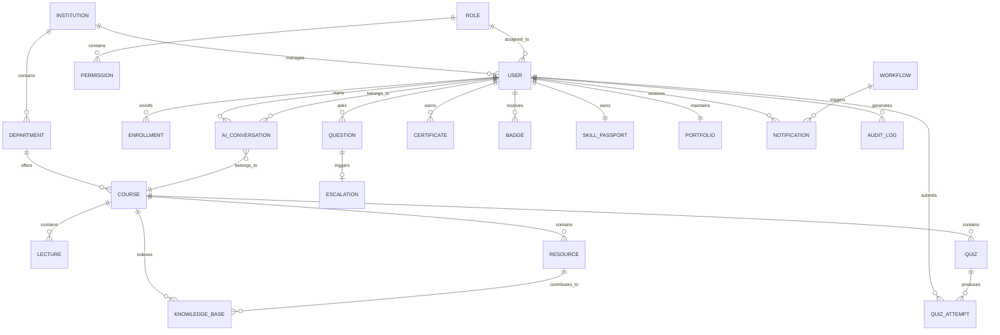

# Entity-Relationship (ER) Diagram

---

# 1. Purpose

This document defines the high-level Entity-Relationship (ER) model for the N.O.V.A. platform. It identifies the primary business entities, their relationships, and the logical structure of the system's data model.

The ER model serves as the foundation for the database schema, application models, and API design.

---

# 2. Core Entities

The platform consists of the following primary entities:

### Institution Domain

* Institution
* Department

### Identity Domain

* User
* Role
* Permission

### Academic Domain

* Course
* Lecture
* Enrollment
* Resource
* Knowledge Base

### Learning Domain

* AI Conversation
* Question
* Quiz
* Quiz Attempt

### Skills Domain

* Certificate
* Badge
* Skill Passport
* Portfolio

### Automation Domain

* Workflow
* Notification

### Security Domain

* Audit Log
* Escalation

---

# 3. Entity Relationship Diagram

---

# 4. Relationship Summary

| Entity          | Description                                                                            |
| --------------- | -------------------------------------------------------------------------------------- |
| Institution     | Represents an educational institution using the platform.                              |
| Department      | Academic department within an institution.                                             |
| User            | Represents Students, Lecturers, Institution Administrators, and System Administrators. |
| Role            | Defines a user's role within the platform.                                             |
| Permission      | Represents fine-grained permissions assigned through roles.                            |
| Course          | Academic course offered by a department.                                               |
| Lecture         | Individual teaching session within a course.                                           |
| Enrollment      | Associates students with courses.                                                      |
| Resource        | Learning materials such as PDFs, presentations, and videos.                            |
| Knowledge Base  | Lecturer-approved academic resources indexed for AI retrieval.                         |
| AI Conversation | Stores conversations between users and the AI Assistant.                               |
| Question        | Academic question submitted by a student.                                              |
| Escalation      | Low-confidence AI responses forwarded to lecturers.                                    |
| Quiz            | AI-generated or lecturer-created assessments.                                          |
| Quiz Attempt    | Student responses and results for quizzes.                                             |
| Certificate     | Verified academic achievements and certifications.                                     |
| Badge           | Achievement and gamification rewards.                                                  |
| Skill Passport  | Comprehensive record of verified student skills.                                       |
| Portfolio       | Professional portfolio metadata maintained by students.                                |
| Workflow        | Academic automation processes.                                                         |
| Notification    | System-generated notifications and alerts.                                             |
| Audit Log       | Records security events and user activities.                                           |

---

# 5. Design Principles

The ER model follows these principles:

* Normalized relational design.
* UUIDs used as primary keys.
* Foreign keys enforce referential integrity.
* Institution-aware multi-tenancy.
* Separation of business domains.
* Extensible schema for future enhancements.
* Support for AI, analytics, automation, and academic workflows.

---

# 6. Future Evolution

Future versions of the ER model may introduce additional entities such as:

* Learning Path
* Discussion Forum
* Research Project
* Internship
* Employer
* Job Application
* AI Feedback
* Learning Analytics Snapshot
* Calendar Event
* External LMS Integration
