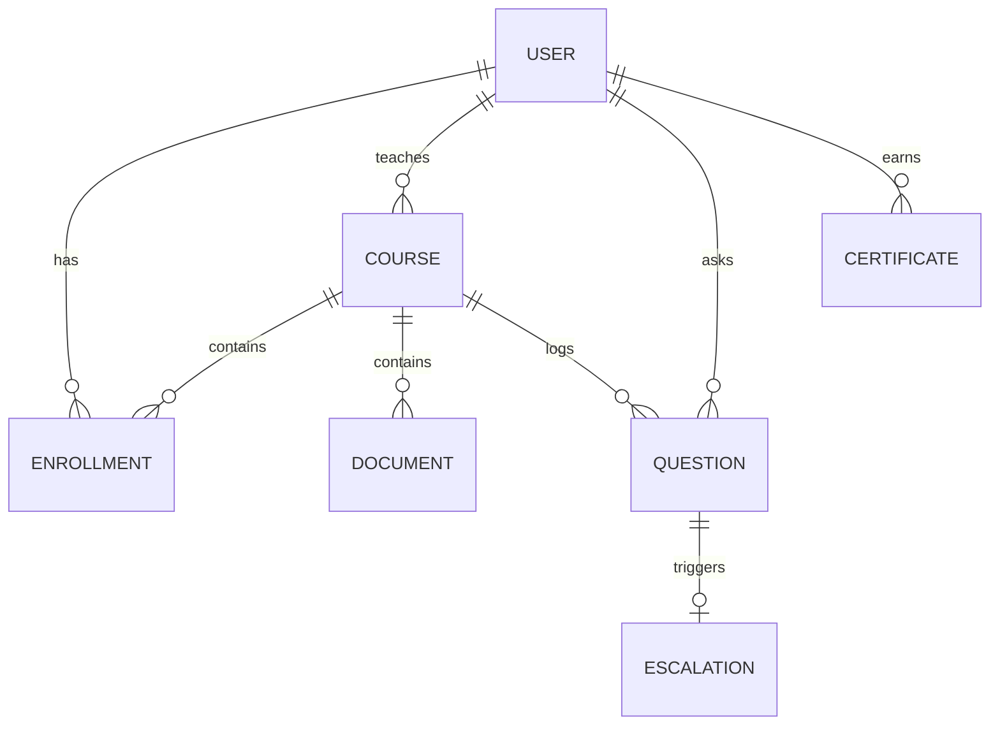

# Entity-Relationship (ER) Diagram

## 1. Core Entities
* **User:** Accounts for Students, Lecturers, and Admins.
* **Course:** Subjects managed by Lecturers.
* **Enrollment:** Links Students to Courses.
* **Document:** Uploaded materials for courses.
* **Question:** Student-asked queries.
* **Escalation:** Questions routed to Lecturers.
* **Certificate:** Verified student achievements.

## 2. ER Diagram Schema

