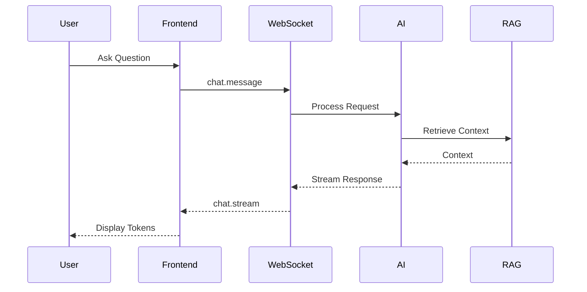
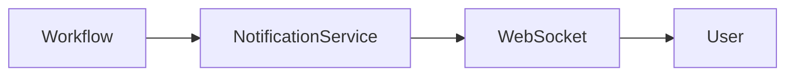
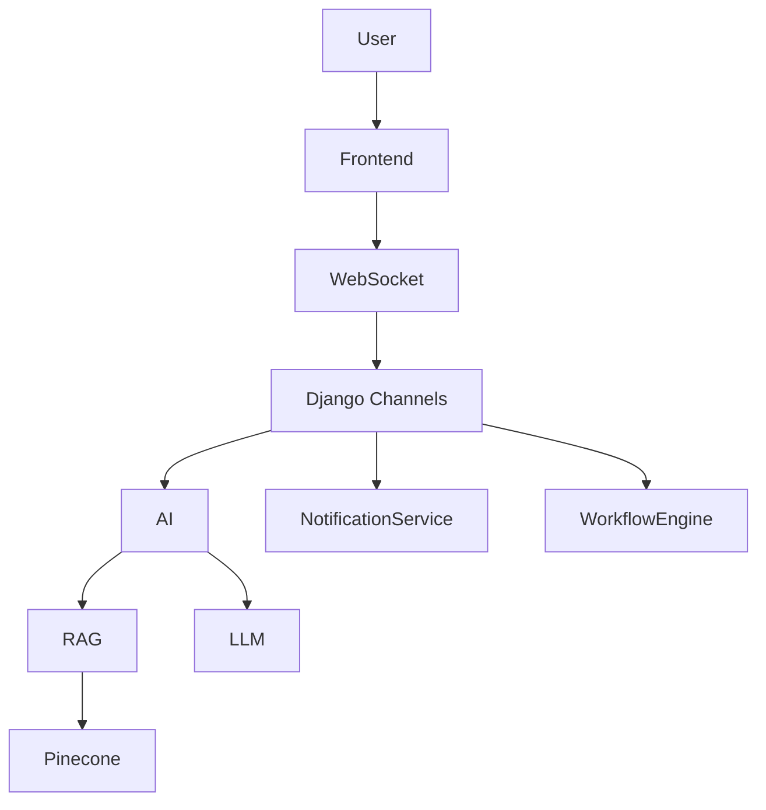

# WebSocket API Specification

---

# 1. Introduction

## 1.1 Purpose

This document defines the WebSocket communication architecture of the N.O.V.A. platform. It specifies the real-time channels, event types, message formats, authentication requirements, and communication workflows.

WebSockets are used for bidirectional communication where low latency and continuous updates are required.

---

# 2. Objectives

The WebSocket layer provides:

* Real-Time AI Response Streaming
* Live Classroom Updates
* Instant Notifications
* Workflow Status Updates
* Typing Indicators
* User Presence
* Future Collaborative Learning

---

# 3. Connection Endpoint

Development

```text
ws://localhost:8000/ws/
```

Production

```text
wss://api.nova.edu/ws/
```

---

# 4. Authentication

All WebSocket connections require authentication.

Authentication methods:

* JWT Access Token
* Session Authentication (Internal)

Example

```text
ws://localhost:8000/ws/chat/?token=<jwt_token>
```

Connections without valid authentication shall be rejected.

---

# 5. Communication Channels

The platform defines the following channels.

| Channel        | Purpose                  |
| -------------- | ------------------------ |
| /chat          | AI conversations         |
| /lecture       | Live lectures            |
| /notifications | Notifications            |
| /workflow      | Workflow execution       |
| /presence      | User presence            |
| /analytics     | Live dashboards (Future) |

---

# 6. AI Chat Channel

Endpoint

```text
/ws/chat/
```

Supported Events

* chat.message
* chat.stream
* chat.complete
* chat.error
* chat.escalation

---

# 7. Notification Channel

Endpoint

```text
/ws/notifications/
```

Supported Events

* notification.created
* notification.updated
* notification.deleted
* notification.read

---

# 8. Lecture Channel

Endpoint

```text
/ws/lecture/
```

Supported Events

* lecture.started
* lecture.ended
* lecture.message
* lecture.resource_uploaded
* lecture.poll
* lecture.attendance

---

# 9. Workflow Channel

Endpoint

```text
/ws/workflow/
```

Supported Events

* workflow.started
* workflow.progress
* workflow.completed
* workflow.failed

---

# 10. Presence Channel

Endpoint

```text
/ws/presence/
```

Supported Events

* user.online
* user.offline
* user.typing
* user.idle

---

# 11. Message Format

Client Request

```json
{
    "event": "chat.message",
    "data": {
        "conversation_id": "uuid",
        "message": "Explain recursion."
    }
}
```

Server Response

```json
{
    "event": "chat.stream",
    "data": {
        "content": "Recursion is..."
    }
}
```

---

# 12. AI Streaming Workflow



---

# 13. Notification Workflow



---

# 14. Error Handling

Possible errors include:

* Authentication Failure
* Invalid Event
* Connection Timeout
* Rate Limit Exceeded
* Internal Server Error
* AI Service Failure

Error messages follow a standardized format.

---

# 15. Reconnection Strategy

If a connection is interrupted:

1. Detect disconnection.
2. Retry automatically using exponential backoff.
3. Re-authenticate if necessary.
4. Resume communication.

---

# 16. Security

Security controls include:

* JWT Authentication
* TLS Encryption (WSS)
* Origin Validation
* Message Validation
* Rate Limiting
* Session Timeout
* Audit Logging

---

# 17. Performance

Performance optimizations include:

* Message Compression
* Connection Pooling
* Heartbeat Messages
* Efficient Serialization
* Asynchronous Event Processing

---

# 18. Architecture Diagram



---

# 19. Future Enhancements

Future WebSocket capabilities may include:

* Collaborative Whiteboards
* Live Code Editor
* Shared AI Sessions
* Screen Sharing
* Video Conferencing
* Real-Time Quiz Competitions
* Live Classroom Analytics
* Multi-User AI Collaboration
