# User Flows

---

# 1. Introduction

## 1.1 Purpose

This document defines the primary user journeys within the N.O.V.A. platform. User flows describe how different user roles interact with the system to accomplish common tasks while ensuring consistency, usability, and efficiency.

---

# 2. Actors

The primary users of the platform are:

* Student
* Lecturer
* Institution Administrator
* System Administrator

Each actor has different permissions and workflows.

---

# 3. Student Login Flow

## Description

This flow describes how a student authenticates and accesses the platform.

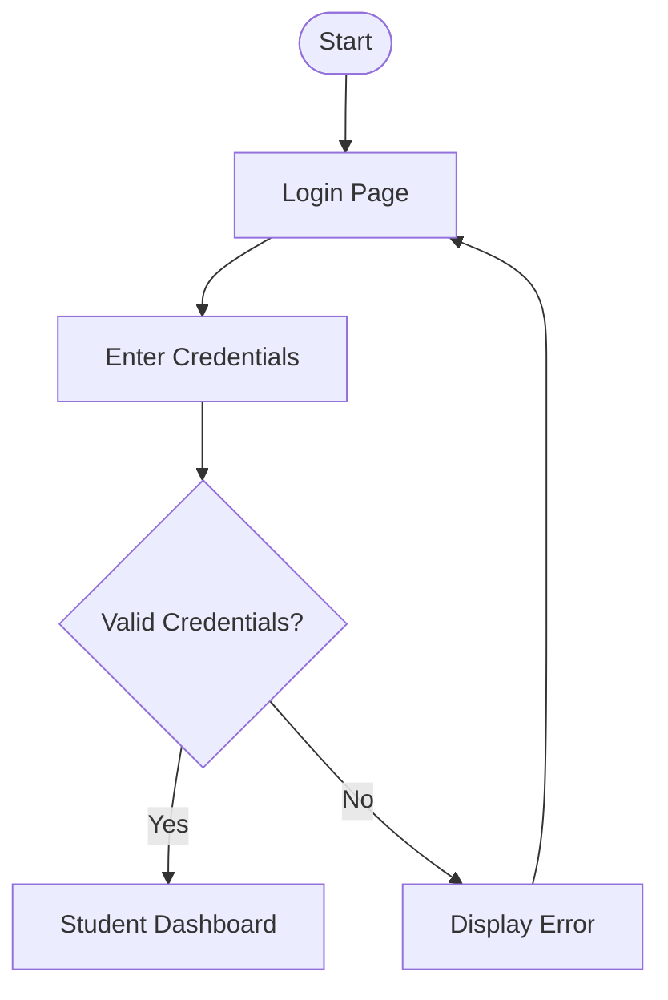

---

# 4. AI Academic Assistant Flow

## Description

This flow illustrates how a student interacts with the AI Academic Assistant.

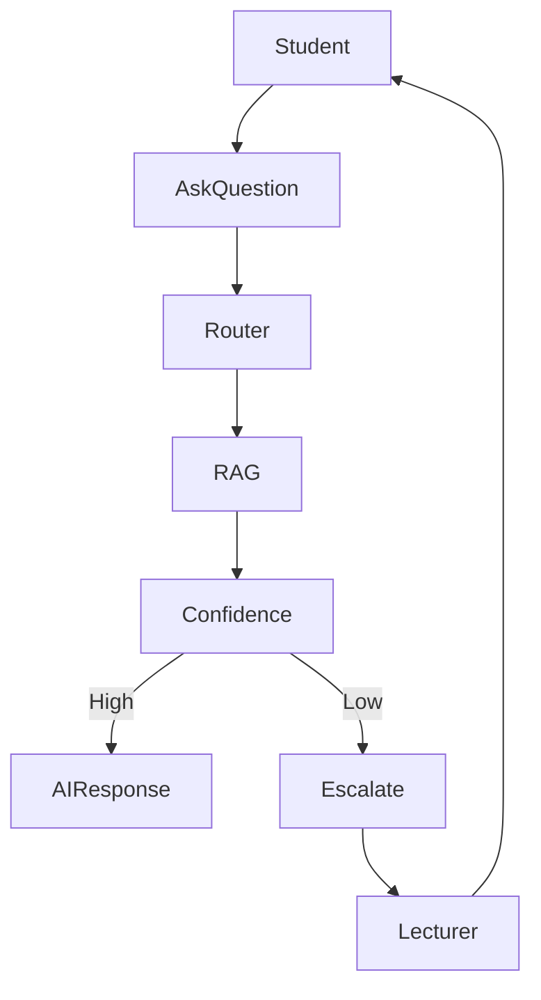

---

# 5. Lecturer Resource Upload Flow

## Description

This flow describes how lecturers upload learning resources.

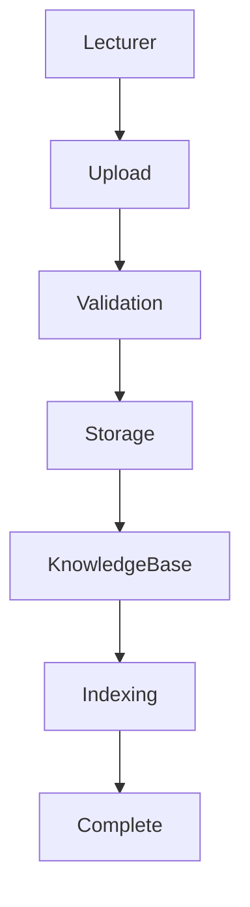

---

# 6. Quiz Generation Flow

## Description

Students request AI-generated quizzes based on course content.

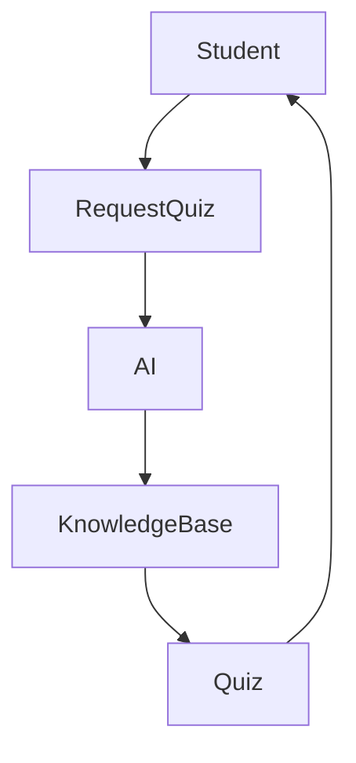

---

# 7. Certificate Verification Flow

## Description

Students upload certificates for verification.

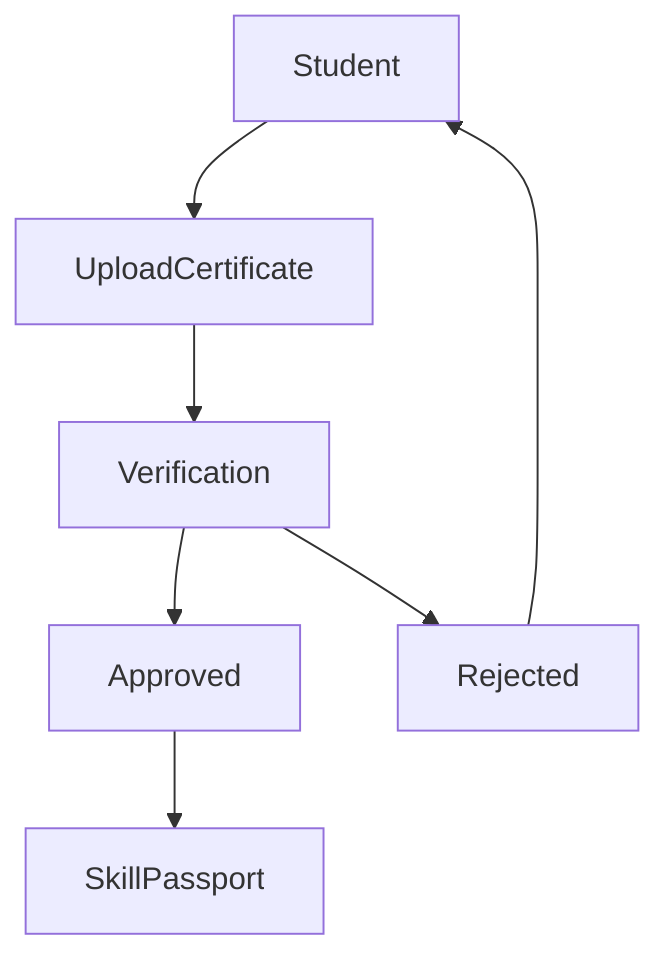

---

# 8. Portfolio Generation Flow

## Description

Students generate a professional portfolio.

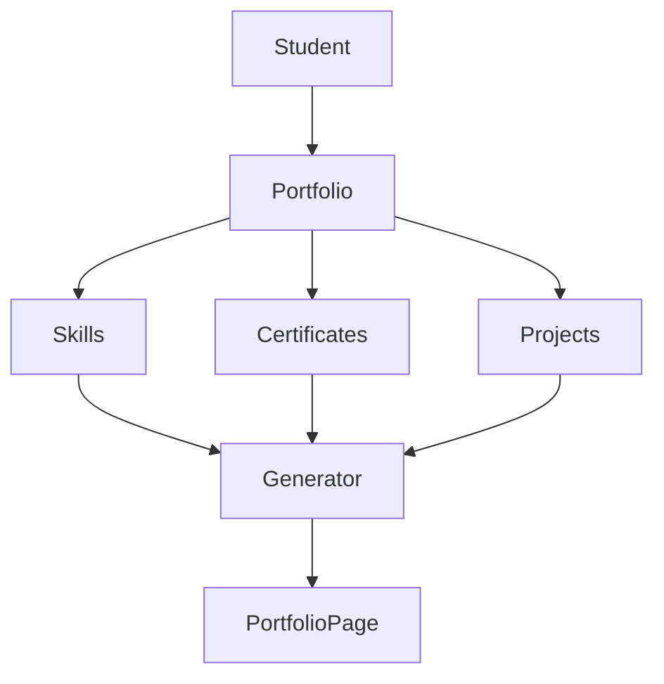

---

# 9. Workflow Automation Flow

## Description

Institution administrators create automation workflows.

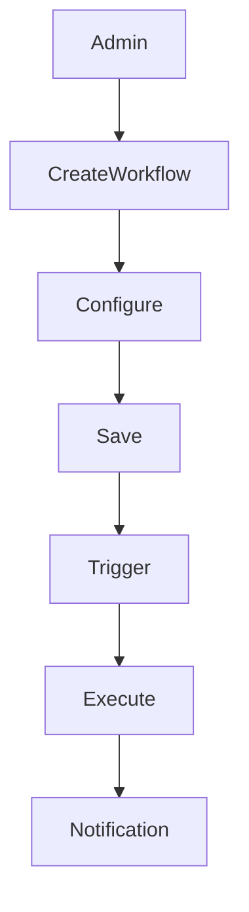

---

# 10. Notification Flow

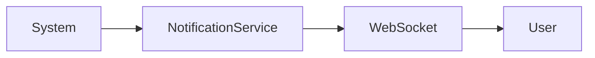

Notifications are delivered in real time whenever possible.

---

# 11. Student Learning Journey

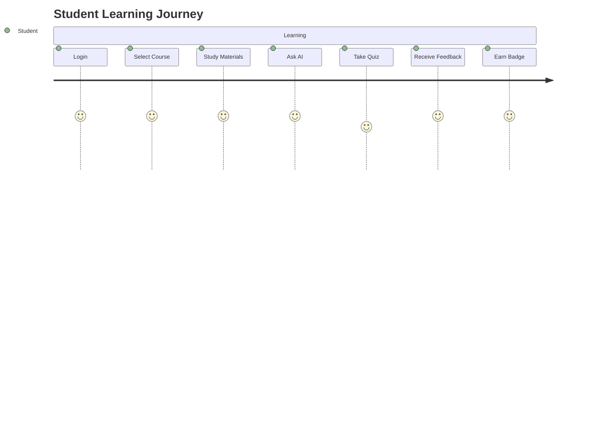

---

# 12. Lecturer Journey

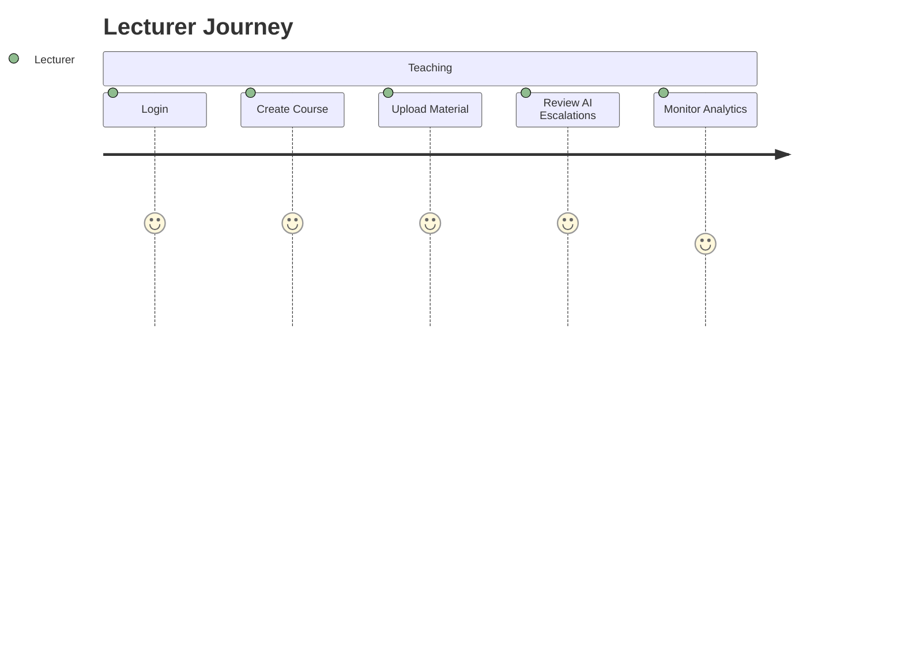

---

# 13. Institution Administrator Journey

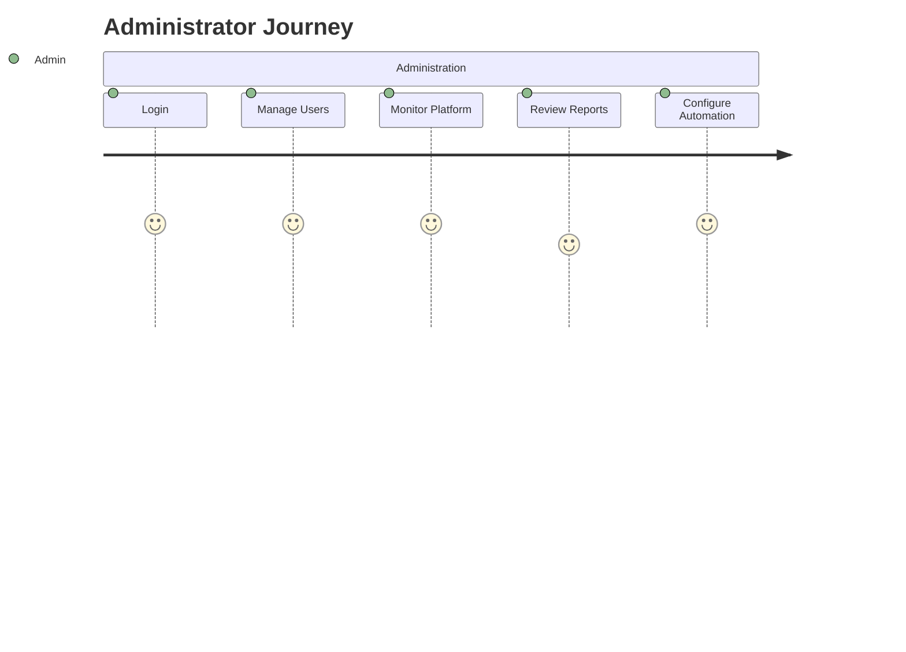

---

# 14. Navigation Summary

| User                      | Primary Destination   |
| ------------------------- | --------------------- |
| Student                   | Learn Dashboard       |
| Lecturer                  | Teach Dashboard       |
| Institution Administrator | Institution Dashboard |
| System Administrator      | System Console        |

---

# 15. Future User Flows

Future versions of the platform may introduce additional workflows such as:

* Internship Application
* Employer Recruitment
* Research Collaboration
* AI Voice Tutor
* Live Classroom Collaboration
* Multi-Institution Learning
* Community Discussion Forums
