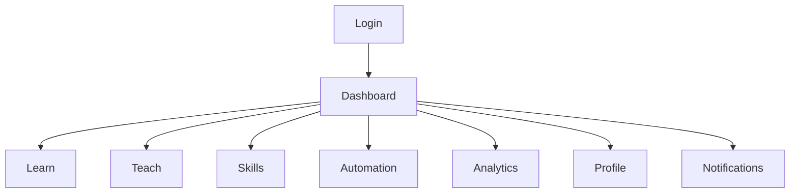
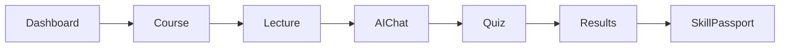

# Wireframes

---

# 1. Introduction

## 1.1 Purpose

This document presents the low-fidelity wireframes for the N.O.V.A. platform. The wireframes define the structure, layout, navigation, and key interface elements of each major screen.

The purpose of these wireframes is to establish a consistent user interface before visual design and implementation.

---

# 2. Design Objectives

The wireframes are designed to:

* Prioritize usability.
* Maintain consistency.
* Reduce user navigation complexity.
* Support responsive layouts.
* Provide intuitive access to platform features.

---

# 3. Login Screen

## Purpose

Authenticate users before accessing the platform.

### Components

* Platform Logo
* Welcome Message
* Email Field
* Password Field
* Login Button
* Google Sign-In Button
* Forgot Password Link

### Navigation

* Successful Login → Dashboard
* Forgot Password → Reset Password

---

# 4. Dashboard

## Purpose

Provide users with a summary of their academic activities.

### Components

* Top Navigation Bar
* Sidebar Navigation
* Welcome Card
* AI Assistant Widget
* Recent Courses
* Upcoming Lectures
* Notifications Panel
* Progress Overview
* Quick Actions

---

# 5. Learn Module

## Purpose

Allow students to interact with the AI Academic Assistant.

### Components

* Conversation List
* Chat Window
* AI Response Panel
* Citation Panel
* Suggested Resources
* Follow-up Questions
* Input Box

---

# 6. Teach Module

## Purpose

Enable lecturers to manage academic resources.

### Components

* Course Selector
* Lecture List
* Upload Resource Button
* Resource Library
* Knowledge Base Status
* AI Insights
* Student Questions

---

# 7. Skills Module

## Purpose

Display verified skills and achievements.

### Components

* Skill Passport
* Certificates
* Badges
* Portfolio
* Resume Export
* Verification Status

---

# 8. Automation Module

## Purpose

Manage academic workflows.

### Components

* Workflow List
* Workflow Builder
* Trigger Configuration
* Execution History
* Integration Status

---

# 9. Analytics Dashboard

## Purpose

Present institutional insights.

### Components

* KPI Cards
* Charts
* Course Statistics
* AI Usage Metrics
* Student Performance
* Export Reports

---

# 10. Notifications

## Purpose

Provide real-time alerts.

### Components

* Notification List
* Read/Unread Indicator
* Filter Controls
* Notification Details

---

# 11. Profile

## Purpose

Allow users to manage personal information.

### Components

* Profile Picture
* Personal Details
* Institution Information
* Account Settings
* Security Settings
* Connected Accounts

---

# 12. Responsive Layout

The interface adapts to:

### Desktop

* Full Sidebar
* Multi-column Layout
* Expanded Dashboard Widgets

### Tablet

* Collapsible Sidebar
* Two-column Layout

### Mobile

* Bottom Navigation
* Single-column Layout
* Simplified Cards

---

# 13. Navigation Structure

---

# 14. Screen Relationships

---

# 15. Future Wireframes

Additional wireframes may include:

* Mobile App
* Employer Portal
* Institution Management
* Live Classroom
* AI Voice Assistant
* Research Workspace
* Community Forum
