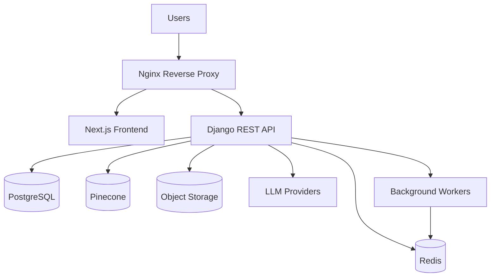

# Deployment Architecture

---

# 1. Introduction

## 1.1 Purpose

This document defines the deployment architecture of the N.O.V.A. platform. It describes how application components are packaged, deployed, monitored, secured, and maintained across development, staging, and production environments.

The deployment architecture ensures scalability, reliability, maintainability, and operational efficiency.

---

# 2. Deployment Goals

The deployment architecture aims to:

* Simplify application deployment
* Support cloud-native infrastructure
* Ensure high availability
* Enable horizontal scalability
* Support Continuous Integration and Deployment (CI/CD)
* Facilitate monitoring and logging
* Provide reliable backup and disaster recovery

---

# 3. Deployment Environments

The platform supports three environments.

| Environment | Purpose                            |
| ----------- | ---------------------------------- |
| Development | Local feature development          |
| Staging     | Integration and acceptance testing |
| Production  | Live institutional deployment      |

Each environment shall maintain independent configuration and credentials.

---

# 4. Containerization

All major services shall be containerized using Docker.

Primary containers include:

* Frontend (Next.js)
* Backend (Django)
* PostgreSQL
* Redis
* Nginx
* Background Workers
* Monitoring Services

Containerization ensures consistent execution across environments.

---

# 5. High-Level Deployment Topology

---

# 6. Reverse Proxy

Nginx serves as the reverse proxy.

Responsibilities include:

* HTTPS Termination
* Request Routing
* Static File Delivery
* Compression
* Security Headers
* Load Balancing (Future)

---

# 7. Background Processing

Long-running tasks execute asynchronously.

Examples:

* Embedding Generation
* Knowledge Indexing
* Email Delivery
* Report Generation
* Notification Dispatch
* Scheduled Automation

Recommended implementation:

* Celery
* Redis Message Broker

---

# 8. Continuous Integration / Continuous Deployment

The platform adopts an automated CI/CD pipeline.

Pipeline stages include:

1. Source Code Checkout
2. Dependency Installation
3. Static Analysis
4. Unit Testing
5. Build Docker Images
6. Integration Testing
7. Deployment to Staging
8. Manual Approval
9. Production Deployment

GitHub Actions is recommended as the CI/CD platform.

---

# 9. Configuration Management

Environment-specific configuration includes:

* Database URL
* JWT Secret
* Google OAuth Credentials
* Pinecone API Key
* LLM Provider Keys
* SMTP Configuration
* Redis URL

Secrets shall never be committed to version control.

Environment variables shall be managed securely.

---

# 10. Monitoring

The deployment architecture includes monitoring for:

* API Availability
* Database Health
* AI Response Time
* Queue Length
* CPU Utilization
* Memory Usage
* Disk Usage
* Network Performance

Critical failures shall trigger alerts.

---

# 11. Logging

Centralized logging captures:

* Application Logs
* API Requests
* Authentication Events
* AI Operations
* Workflow Execution
* Background Tasks
* Infrastructure Events

Logs shall support troubleshooting and auditing.

---

# 12. Backup Strategy

The deployment architecture supports:

* Daily Database Backups
* Incremental Backups
* Object Storage Backups
* Configuration Backups
* Backup Verification
* Point-in-Time Recovery

Backup restoration procedures shall be periodically tested.

---

# 13. Scalability

Scalability strategies include:

* Horizontal Application Scaling
* Redis Caching
* Stateless Backend Services
* Background Workers
* Database Read Replicas (Future)
* Load Balancing (Future)

The architecture supports growth without major redesign.

---

# 14. Disaster Recovery

Recovery procedures include:

* Database Restoration
* Configuration Recovery
* Object Storage Recovery
* Infrastructure Redeployment
* Service Health Validation

Recovery documentation shall be maintained and periodically reviewed.

---

# 15. Deployment Security

Deployment security measures include:

* HTTPS Everywhere
* Secure Secrets Management
* Container Image Scanning
* Principle of Least Privilege
* Firewall Rules
* Automatic Security Updates
* Audit Logging

Production credentials shall remain isolated from development environments.

---

# 16. Deployment Architecture Diagram

---

# Architecture Decision Record

## AD-010 – Containerized Cloud-Native Deployment

### Status

Accepted

---

### Context

The platform must be deployable across multiple environments while maintaining consistency, portability, and operational simplicity.

---

### Decision

N.O.V.A. shall adopt a containerized deployment strategy using Docker and GitHub Actions for automated CI/CD.

Nginx shall serve as the reverse proxy, while background tasks shall execute through Celery workers.

---

### Alternatives Considered

**Traditional Server Deployment**

Advantages

* Simpler initial setup

Disadvantages

* Environment inconsistencies
* Manual deployments
* Difficult scalability
* Limited portability

---

### Rationale

Containerization provides consistent environments, simplifies deployment, improves portability, and supports future scaling.

---

### Consequences

Positive

* Reproducible deployments
* Simplified environment management
* Improved scalability
* Easier rollback
* Better DevOps practices

Negative

* Initial Docker setup complexity
* Additional infrastructure components

The operational advantages outweigh the initial setup effort.

---

# 17. Future Evolution

Future deployment improvements may include:

* Kubernetes Orchestration
* Auto Scaling
* Blue-Green Deployments
* Canary Releases
* Multi-Region Deployment
* CDN Integration
* Service Mesh
* Infrastructure as Code (Terraform)
