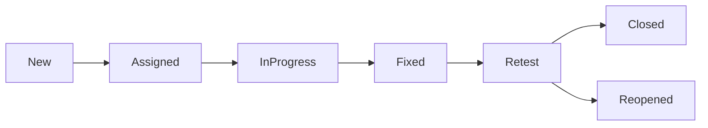

# Test Plan

---

# 1. Introduction

## 1.1 Purpose

This document defines the detailed test plan for the N.O.V.A. platform. It outlines the testing activities, schedule, responsibilities, scope, environments, resources, deliverables, and success criteria required to validate the system before release.

---

# 2. Test Objectives

The objectives of this test plan are to:

* Verify that all functional requirements are implemented correctly.
* Validate non-functional requirements.
* Ensure secure operation.
* Confirm AI response quality.
* Verify database integrity.
* Validate API behavior.
* Ensure system stability before deployment.

---

# 3. Test Scope

The following modules shall be tested.

## Functional Modules

* Authentication
* User Management
* Learn Module
* Teach Module
* Skills Module
* Workflow Automation
* Notifications
* Analytics

## AI Modules

* AI Academic Assistant
* RAG Pipeline
* Quiz Generation
* Recommendation Engine
* Confidence Evaluation
* Lecturer Escalation

## Infrastructure

* REST APIs
* WebSocket APIs
* PostgreSQL
* Redis
* Pinecone
* Docker Deployment

---

# 4. Test Items

| Component            | Test Type                  |
| -------------------- | -------------------------- |
| Authentication       | Functional                 |
| User Management      | Functional                 |
| AI Assistant         | Functional + AI Evaluation |
| RAG Pipeline         | Integration                |
| Quiz Module          | Functional                 |
| Portfolio Builder    | Functional                 |
| Workflow Engine      | Integration                |
| Notification Service | Functional                 |
| Database             | Integration                |
| APIs                 | Integration                |
| Frontend             | UI Testing                 |

---

# 5. Test Environment

The testing environment consists of:

* Ubuntu Linux
* Docker
* PostgreSQL
* Redis
* Django Backend
* Next.js Frontend
* Pinecone
* LLM Provider
* Modern Web Browser

Testing should closely mirror the production environment.

---

# 6. Testing Schedule

| Phase   | Activity                |
| ------- | ----------------------- |
| Phase 1 | Unit Testing            |
| Phase 2 | Integration Testing     |
| Phase 3 | System Testing          |
| Phase 4 | Performance Testing     |
| Phase 5 | Security Testing        |
| Phase 6 | AI Evaluation           |
| Phase 7 | User Acceptance Testing |

Each phase shall be completed before the next begins unless parallel execution is approved.

---

# 7. Roles and Responsibilities

| Role                       | Responsibility                     |
| -------------------------- | ---------------------------------- |
| Developers                 | Unit testing and bug fixing        |
| QA Team                    | Functional and regression testing  |
| Lecturers                  | Academic content validation        |
| Institution Administrators | Administrative workflow validation |
| Project Team               | Final approval                     |

---

# 8. Entry Criteria

Testing begins when:

* Development tasks are completed.
* Required services are operational.
* Test environment is configured.
* Test data is available.
* Critical blockers have been resolved.

---

# 9. Exit Criteria

Testing concludes when:

* All critical defects are resolved.
* High-priority defects are resolved or formally accepted.
* Required test coverage is achieved.
* Acceptance criteria are satisfied.
* Final approval has been granted.

---

# 10. Test Deliverables

The testing phase produces:

* Test Cases
* Test Reports
* Defect Reports
* Performance Reports
* Security Reports
* AI Evaluation Reports
* Acceptance Test Report
* Final Test Summary

---

# 11. Risks

Potential risks include:

* Third-party AI provider outages
* Limited test data
* Infrastructure instability
* Performance degradation
* Requirement changes
* Delayed bug fixes

Risk mitigation plans shall be documented and reviewed regularly.

---

# 12. Defect Lifecycle

---

# 13. Traceability

All test cases shall be traceable to the Software Requirements Specification (SRS).

Each functional requirement shall have one or more associated test cases.

This ensures complete requirements coverage.

---

# 14. Success Criteria

The release is considered successful when:

* Functional requirements are satisfied.
* AI performance meets defined thresholds.
* Security testing reveals no critical vulnerabilities.
* Performance objectives are achieved.
* User acceptance testing is approved.

---

# 15. Future Improvements

Future testing enhancements may include:

* Continuous Testing Pipelines
* Automated Regression Suites
* AI-Assisted Test Generation
* Cloud-Based Test Environments
* Synthetic User Monitoring
* Chaos Engineering
